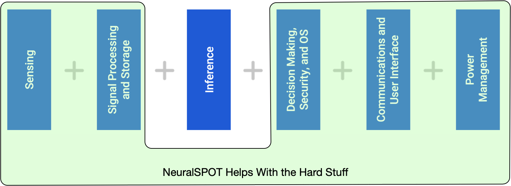
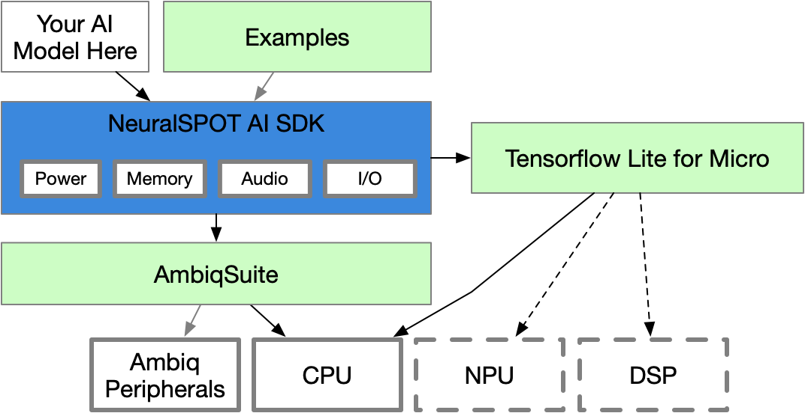

# NeuralSPOT
NeuralSPOT is Ambiq's AI Enablement Library. It implements an AI-centric API for common tasks such as collecting audio from Ambiq's peripherals, computing features from that audio, controlling power modes, reading accelerometer and gyroscopic data from i2c sensors, and a variety of helper functions and tools which make developing AI features on Ambiq hardware easier.




# Building and Deploying NeuralSPOT

NeuralSPOT is designed to be used in two ways:
1. **As the 'base of operations' for your AI development**. Intended for stand-alone EVB development, you can add new binary (axf) targets to the /examples directory
2. **As a seed for adding NeuralSPOT to a larger project**. In this mode of operations, you would use NeuralSPOT to create a stub project (a [nest](#The Nest)) with everything needed to start running AI on EVBs

## Build Options
All `make` invocations for NS must be done from the base directory ("nest" makes are different, and defined below). The primary targets are:

`make` - builds everything, including libraries and every target in examples directory
`make libraries` - builds the neuralspot and extern libraries
`make clean` - deletes every build directory and artifact
`make nest` - creates a minimal '[nest](#The Nest)' with a basic main.cc stub file

Besides targets, NeuralSPOT has a standard set of compile-time switches to help you configure the build exactly the way you need. These are set via the normal make convention, e.g. `make BOARD=apollo4b`.

| Parameter | Description | Default |
| --------- | ----------- | ------- |
| BOARD | Defines the target SoC (currently either apollo4b or apollo4p) | apollo4p |
| EVB | Defines the EVB type (evb or evb_blue) | evb |
| BINDIR | Name of directories where binaries and build artifacts are stored. Note that there will be one build directory per binary or library being created | build |
| NESTDIR | Relative path and directory name where nest will be created | nest |
| AS_VERSION | Ambiqsuite Version | R4.1.0 |
| TF_VERSION | Tensflow Lite for Microcontrollers Version | R2.3.1 |
| TARGET | Defines what target will be loaded by `make deploy` | s2i |
| MLDEBUG | Setting to '1' turns on TF debug prints | 0 |
| AUDIO_DEBUG | Setting to '1' turns on RTT audio dump | 0 |

Note that defaults for these values are set in `./make/neuralspot_config.mk`.

# NeuralSPOT Repo Structure

NeuralSPOT consists of the neuralspot library, required external components, and examples. 

```/neuralspot - contains all code for NeuralSPOT libraries
neuralspot/ - contains neuralspot feature-specific libraries
	ns-audio/
		src/
		include_api/
		module.mk
	ns-ipc/
	ns-<some-other-feature>
	...
extern/   - contains external dependencies, including TF and AmbiqSuite
	AmbiqSuite/
		<version>/
	tensorflow/
		<version>/
/examples - contains several examples, each of which can be compiled to a deployable axf
/make     - contains makefile helpers, including neuralspot-config.mk
```


# NeuralSPOT Theory of Operations.

NeuralSPOT is a SDK for AI development on Ambiq products via an AI-friendly API. It offers a set of libraries for accessing hardware, pre-configured instances of external dependencies such as AmbiqSuite and Tensorflow Lite for Microcontrollers, and a handful of examples which compile into deployable binaries.




## NeuralSPOT Libraries

NeuralSPOT is continuously growing, and offers the following libraries today:

1. `ns-audio`: API for collected audio from Ambiq's audio interfaces and sending them to an AI application via several IPC methods. This library also contains audio-centric common AI feature helpers such as configurable Mel-spectogram computation.
2. `ns-peripherals`: API for controlling Ambiq's power modes, performance modes, and helpers for commonly used I/O devices such as EVB buttons.
3. `ns-harness`: a simple harness for abstracting common AmbiqSuite code, meant to be replaced when NeuralSPOT is not being used by AmbiqSuite.
4. `ns-ipc`: Common mechanisms for presenting collected sensor data to AI applications
5. (soon)`ns-experimental-drivers`: Drivers for 3rd party sensors that have not yet been incorporated into mainline AmbiqSuite.

## The Nest

The Nest is an automatically created directory with everything you need to get TF and AmbiqSuite running together and ready to start developing AI features for your application. It is created for your specific target device and only includes needed header files, along with a basic application stub with a main().

### Building Nest

Before building a nest, you must first build NeuralSPOT for your desired target. By default, the nest will be created in NeuralSPOT's root directory - set NESTDIR to change where it is built.

```bash
$> cd neuralSpot
$> make						# this builds the artifacts needed to build the nest
$> make nest			# this creates the nest, use BINDIR=<your directory> to change where
$> cd nest
$> make 					# this builds the Nest stub. 
```

### Nest Directory Contents
```bash
Makefile
autogen.mk # Automatically generated by 'make nest'
make/
	# helper scripts and make includes
includes/
	# *.h files in preserved original directory structure
libs/
	# needed *.a files for both 3rd party and neuralspot libraries
src/
	main.cc
	model.h
```

# WIP
## Adding malloc support
Malloc support is non-deterministic, and should only be used for debug environments such as erpc

It has 3 components
1. ns-malloc
2. example/basic_tf_stub modified to include it
3. ns-harness maps standard malloc/etc to ns-malloc equivalents

### Status
Added malloc and usb to ambiqsuite.a
Created ns-usb with init, send, and rx routines
Next
1. create ns-util malloc stuff, get it compiling (should be easy wrapper around freertos malloc) (DONE)
2. Create new nest in erpc, taking care to not obliterate work in current nest (DONE)
3. Modify erpc transport code to use all of the above
4. Test in main.cc

### New Next
Did 1, 2, 3, and a bit of 4 (don't really have a usb test). Next:
1. Now that ERPC client is compiling, get the python server instantiated
2. Add a simple TempAlarm invocations from evb to python.
3. Profit! Or, more realistically, implement a bulk dump of an audiobuffer.
4. Can we get rid of all the #ifdef DEBUG-style stuff and make it more inline? e.g. use a macro to only dump if a DEFINE is enabled?

### Doozy of a Bug
OK, so the 'don't really have a usb test' above turned out to be a problem. 
USB wasn't working at all, for the following reasons:
1. I wasn't calling the usb_service task (needs to be called in app loop)
2. Missing src files popped up when I added that.
3. TinyUSB needed a missing define, added that to makefile
4. Malloc and TinyUSB weren't getting along. If I did a malloc before initializing USB, nothing happened
	1. This was a doozy of a bug. It turns out FreeRTOS malloc assumes the task manager has been initialized, which sets, among other things, a variable for tracking nested entry/exit of critical regions, during which interrupts are disabled. If the variable wasn't initialized, it disabled interrupts without complaint, but it didn't reenable them.
	2. My solution was to create pvTasklessPort Malloc and vTasklessFree, and modify the original functions to only suspend/resume tasks if a new parameter was set.

TLDR: remember that heap_4.c has been modified, and portable.h! Also, when we add task support to NS, we need to add a config variable to ns-malloc that calls the right malloc/free.

Before I was derailed by Mr. Doozy, I made some progress on ERPC, researching the python endpoint. I switched to the matrix_multiple example which is simpler than tempalarm and closer to what we need anyway.

Now that I have this kind of working, go back to New Next step 2, above.

Regarding nests: we really need an upgrade mechanism (record date of nest creation, look for files in the nest that are newer to that so might get overridden, warn if I find any (maybe back them up automatically))

### New new next
Quick status: kind of have ERPC server/client talking. Server sees RPC after a couple of tries from client, and sees the right data. Eventually it starts getting CRC errors. The RPC response is all zeros on client side.
1. Debug why it takes a few requests.
	1. Clue: the read after the request right doesn't seem to get any data. It could be that the server isn't seeing the first few.
2. Add prints everywhere. Send/receive on client and server sides.
4. Fix send/receive status to return error if data doesn't match requested size
5. Figure out why crc errors start happening, probably some corruption going on.

almost there!

### Works!
I was missing a flush in the usb send. Here is a list of cleanup items:
1. Add flush to ns-usb.h (DONE)
2. Get rid of all the prints I sprinkled everywhere
3. Put NS-specific erpc code in it's own directory for documentation purposes
4. Implement audio interface (instead of matrix multiply) (STARTED)
5. Move code into ns (see below)

### ERPC Flow
1. NS/extern/erpc contains base code needed for ERPC clients, including erpc python
2. NS/ns-audio-dump - add ns-audio-dump.h and all erpc audio-specific code (including erpc for documentation)
3. NS/tools - add audio_erpc_example.py

### Status
1. Cleaned up erpc, created an audio.erpc and a python app that is listening

Next:
1. create new nest, massage code needed to only copy new stuff over
2. Modify main.cc to call audio dump in real world inference loop
3. Copy erpc code over to ns as described above
4. Clean up main.cc by breaking out into multiple files


### Latest Status
RPC for audio works and has been checked in and merged. Now working on i2c drivers.

Next:
1. Get i2c mpu driver running
2. Get i2c dumping via RPC running
3. Write decent documentation on all of that
4. Start clearing out my small item backlog