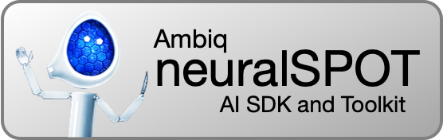
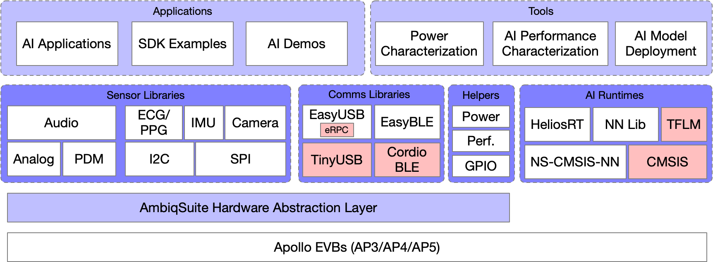

<p align="center">
  <a href="https://github.com/AmbiqAI/neuralSPOT"></a>
</p>

---

> *Code*: [https://github.com/AmbiqAI/neuralSPOT](https://github.com/AmbiqAI/neuralSPOT)
>
> *Documentation*: [https://ambiqai.github.io/neuralSPOT](https://ambiqai.github.io/neuralSPOT)

---

NeuralSPOT is a full-featured AI SDK and toolkit optimized for Ambiqs's Apollo family of ultra-low-power SoCs. It is open-source, real-time, and OS-agnostic. It was designed with Tensorflow Lite for Microcontrollers in mind, but works with any AI runtime.

NeuralSPOT is designed to help embedded AI developers in 3 important ways:

1. **Initial development and fine-tuning of their AI model**: neuralSPOT offers tools to rapidly [characterize the performance and size](./docs/From%20TF%20to%20EVB%20-%20testing,%20profiling,%20and%20deploying%20AI%20models.md) of a TFLite model on Ambiq processors.
2. **Rapid AI feature prototyping**: neuralSPOT's library of easy to use drivers, feature extractors, helper functions, and communication mechanisms accelerate the development of stand-alone AI feature applications to test the model in real-world situations with real-world data and latencies.
3. **AI model library export**: once an AI model has been developed and refined via prototyping, neuralSPOT allows one-click deployment of a static library implementing the AI model, suitable to linking into larger embedded applications.


NeuralSPOT wraps an AI-centric API around AmbiqSuite SDK (Ambiq's hardware abstraction layer) to ease common tasks such as sensing, computing features from the sensor data, performance profiling, and controlling Ambiq's many on-board peripherals.

<p align="center">

</p>


## Requirements

> **NOTE** for detailed compatibility notes, see the [features document](https://github.com/AmbiqAI/neuralSPOT/blob/main/docs/features.md).

* **Hardware**
    * [Ambiq EVB](https://ambiq.com/apollo4/): at least one of [Apollo4 Plus](https://ambiq.com/apollo4-plus/), [Apollo4 Blue Plus](https://ambiq.com/apollo4-blue-plus/), [Apollo4 Lite](https://ambiq.com/apollo4-lite/), [Apollo4 Blue Lite](https://ambiq.com/apollo4-blue-lite/), [Apollo3 Blue Plus](https://ambiq.com/apollo3-blue-plus/), or Ambiq's flagship, the [Apollo510](https://ambiq.com/apollo510/).
    * Energy Measurement (optional): [Joulescope](https://www.joulescope.com)  JS110 or JS220 (only needed for automated model energy measurements)
    * Sensors: some of neuralSPOT's example applications require sensors such as microphones, IMUs, ECG/PPG sensors, and cameras. See the application's README for detailed requirements. 
* **Software**
    * [Segger J-Link 8.12+](https://www.segger.com/downloads/jlink/)
    * Compilers: at least one of...
        * [Arm GNU Toolchain 10.3+](https://developer.arm.com/downloads/-/arm-gnu-toolchain-downloads)
        * [Armclang](https://developer.arm.com/downloads/-/arm-gnu-toolchain-downloads)
    * [GNU Make](https://www.gnu.org/software/make/)
    * [Python 3.11+](https://www.python.org)

## Building and Deploying NeuralSPOT

NeuralSPOT makes it easy to build and deploy your first AI model on Ambiq's EVBs. Before deploying, connect an Ambiq EVB (the following example defaults to Apollo4 Plus).

```bash
git clone git@github.com:AmbiqAI/neuralSPOT.git
cd neuralSPOT
make clean
make -j # makes everything
make deploy # flashes the default example to EVB
make view # connects to the Jlink SWO interface to show printf output from EVB
```

The `make` systems is highly configurable and flexible - see our [makefile options document](docs/makefile-details.md) for more details.

See our [Windows application note](https://github.com/AmbiqAI/neuralSPOT/blob/main/docs/Application-Note-neuralSPOT-and-Windows.md) for Windows-specific considerations.

## Automatic Model Characterization and Packaging

NeuralSPOT includes Autodeploy, a tool to automatically analyze, build, characterize, and package TFLite models. Autodeploy makes use of RPC, so it needs both USB ports to be connected (one for Jlink and one for RPC).

```bash
cd .../neuralSPOT # neuralSPOT's root directory
pip install .
ns_autodeploy --tflite-filename mymodel.tflite
```

This one invocation will:

1. **Analyze the specified TFLite model** file to determine needed ops, input and output tensors, etc.
1. Convert the TFlite into a C file, wrap it in a baseline neuralSPOT application, and flash it to an EVB
1. Perform an initial characterization over USB using RPC and use the results to **fine-tune the application's memory allocation**, then flash the fine-tuned version.
1. Run invoke() both locally and on the EVB, feeding the same data to both, **comparing the results and profiling the performance of the invoke() on the EVB**
1. **Create a static library** (with headers) containing the model, TFLM, and a minimal wrapper to ease integration into applications.
1. Create a simple AmbiqSuite example suitable for copying into AmbiqSuites example directory.

Autodeploy is highly configurable and also **capable of automatically measuring the power** used by inference (if a joulescope is available) - see the [reference guide](https://github.com/AmbiqAI/neuralSPOT/blob/main/tools/README.md) and [application note](https://github.com/AmbiqAI/neuralSPOT/blob/main/docs/From%20TF%20to%20EVB%20-%20testing%2C%20profiling%2C%20and%20deploying%20AI%20models.md) for more details.

## NeuralSPOT Structure and Directories
NeuralSPOT consists of the neuralspot [libraries](https://github.com/AmbiqAI/neuralSPOT/tree/main/neuralspot), required external components, [tools](https://github.com/AmbiqAI/neuralSPOT/tree/main/tools), [applications](https://github.com/AmbiqAI/neuralSPOT/tree/main/apps), and [documentation](https://github.com/AmbiqAI/neuralSPOT/tree/main/docs).




The directory structure reflects the code structure:

```
/neuralspot - contains all code for NeuralSPOT libraries
	/neuralspot # Sensor, communications, and helper libraries
	/extern     # External dependencies, including TF and AmbiqSuite
	/apps       # Example applications, each of which can be compiled to a deployable binary
	/projects   # Examples of how to integrate external projects such as EdgeImpulse models
	/make       # Makefile helpers, including neuralspot-config.mk and local_overrides.mk
	/tools	    # AutoDeploy and RPC python-based tools
	/tests      # Simple compatibility tests
	/docs       # introductory documents, guides, and release notes
```
