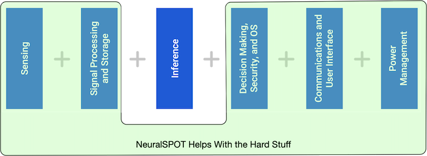
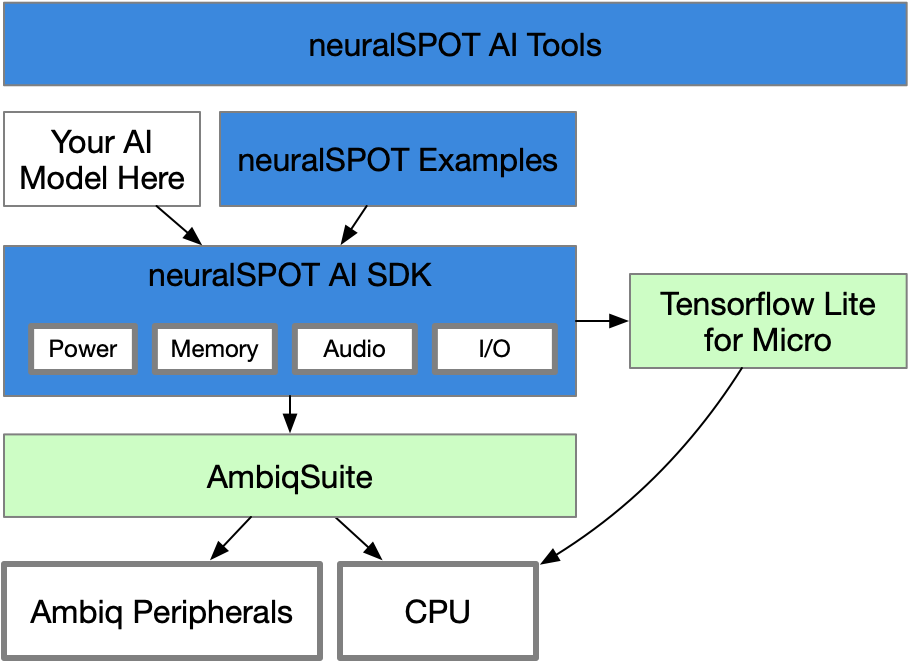

# NeuralSPOT
NeuralSPOT is Ambiq's AI Enablement Library. It implements an AI-centric API for common tasks such as collecting audio from Ambiq's peripherals, computing features from that audio, controlling power modes, reading accelerometer and gyroscopic data from i2c sensors, and a variety of helper functions and tools which make developing AI features on Ambiq hardware easier.



NeuralSPOT documentation is spread throughout the repository - generally, every component has its own documentation, which can be overwhelming. Please visit [`doc/`](https://github.com/AmbiqAI/neuralSPOT/tree/main/docs) for high level documents useful as a starting point for understanding neuralSPOT's overall structure and intended usage.

# Building and Deploying NeuralSPOT

NeuralSPOT is designed to be used in two ways:
1. **As the 'base of operations' for your AI development**. Intended for stand-alone EVB development, you can add new binary (axf) targets to the /examples directory.
2. **As a seed for adding NeuralSPOT to a larger project**. In this mode of operations, you would use NeuralSPOT to create a stub project (a [nest](#The Nest)) with everything needed to start running AI on EVBs.

## Build Options
All `make` invocations for NS must be done from the base directory ("nest" makes are different, and defined below). The primary targets are:

| Target               | Description                                                  |
| -------------------- | ------------------------------------------------------------ |
| `make`               | builds everything, including libraries and every target in examples directory |
| `make clean`         | deletes every build directory and artifact                   |
| `make libraries`     | builds the neuralspot and external component libraries       |
| `make nestall`       | creates a minimal '[nest](#The_Nest)' with a basic main.cc stub file |
| `make nest`          | creates a minimal '[nest](#The_Nest)' *without* a basic main.cc stub file and without overwriting makefiles |
| `make nestcomponent` | updates a single component in the nest                       |
| `make deploy`        | Uses jlink to deploy an application to a connected EVB       |
| `make view`          | Starts a SWO interface                                       |

Besides targets, NeuralSPOT has a standard set of compile-time switches to help you configure the build exactly the way you need. These are set via the normal make conpiption, e.g. `make BOARD=apollo4b`.

| Parameter | Description | Default |
| --------- | ----------- | ------- |
| BOARD | Defines the target SoC (currently either apollo4b or apollo4p) | apollo4p |
| EVB | Defines the EVB type (evb or evb_blue) | evb |
| BINDIR | Name of directories where binaries and build artifacts are stored. Note that there will be one build directory per binary or library being created | build |
| NESTDIR | Relative path and directory name where nest will be created | nest |
| NESTCOMP | root path to a single component to be updated in nest | extern/AmbiqSuite |
| NESTEGG | name of neuralspot example used to create nest | basic_tf_stub |
| AS_VERSION | Ambiqsuite Version | R4.3.0 |
| TF_VERSION | Tensflow Lite for Microcontrollers Version | 0c46d6e |
| TARGET | Defines what target will be loaded by `make deploy` | basic_tf_stub |
| MLDEBUG | Setting to '1' turns on TF debug prints | 0 |
| AUDIO_DEBUG | Setting to '1' turns on RTT audio dump | 0 |

> **Note**  Defaults for these values are set in `./make/neuralspot_config.mk`. Ambiq EVBs are available in a number of flavors, each of which requiring slightly different config settings. For convenience, these settings can be placed in `./make/local_overrides.mk` (note that this file is ignored by git to prevent inadvertent overrides making it into the repo). To make changes to this file without tracking them in git, you can do the following:
> `$> git update-index --assume-unchanged make/local_overrides.mk`

# NeuralSPOT Repo Structure

NeuralSPOT consists of the neuralspot library, required external components, and examples.

```/neuralspot - contains all code for NeuralSPOT libraries
neuralspot/ # contains neuralspot feature-specific libraries
extern/     # contains external dependencies, including TF and AmbiqSuite
/examples   # contains several examples, each of which can be compiled to a deployable axf
/projects   # contains examples of how to integrate external projects such as EdgeImpulse models
/make       # contains makefile helpers, including neuralspot-config.mk
/docs       # introductory documents, guides, and release notes
```

# NeuralSPOT Theory of Operations.

NeuralSPOT is a SDK for AI development on Ambiq products via an AI-friendly API. It offers a set of libraries for accessing hardware, pre-configured instances of external dependencies such as AmbiqSuite and Tensorflow Lite for Microcontrollers, and a handful of examples which compile into deployable binaries.



## NeuralSPOT Libraries and Features

NeuralSPOT is continuously growing, and offers the following libraries today - for a full list of features, see our [Feature Guide](https://github.com/AmbiqAI/neuralSPOT/blob/main/docs/feature-guide.md).

1. `ns-audio`: [Library for sampling audio](neuralspot/ns-audio/ns-audio.md) from Ambiq's audio interfaces and sending them to an AI application via several IPC methods. This library also contains audio-centric common AI feature helpers such as configurable Mel-spectogram computation.
2. `ns-peripherals`: API for controlling Ambiq's power modes, performance modes, and helpers for commonly used I/O devices such as EVB buttons.
3. `ns-harness`: a simple harness for abstracting common AmbiqSuite code, meant to be replaced when NeuralSPOT is not being used by AmbiqSuite.
4. `ns-ipc`: Common mechanisms for presenting collected sensor data to AI applications
5. ... and many more

## The Nest

The Nest is an automatically created directory with everything you need to get TF and AmbiqSuite running together and ready to start developing AI features for your application. It is created for your specific target device and only includes needed header files, along with a basic application stub with a main(). Nests are designed to accomodate various development flows - for a deeper discussion, see [Developing with neuralSPOT](docs/Developing_with_NeuralSPOT.md).

### Building Nest

Before building a nest, you must first build NeuralSPOT for your desired target. By default, the nest will be created in NeuralSPOT's root directory - set NESTDIR to change where it is built.

```bash
$> cd neuralSpot
$> make		       # this builds the artifacts needed to build the nest
$> make nestall  # this creates the nest, use BINDIR=<your directory> to change where
$> cd nest
$> make          # this builds the Nest basic_tf_stub.
```

### Nest Directory Contents
```bash
Makefile
autogen.mk # Automatically generated by 'make nest'
make/      # helper scripts and make includes
includes/  # *.h files in preserved original directory structure
libs/      # needed *.a files for both 3rd party and neuralspot libraries
src/
	<nestegg sources>
srcpreserved/
	<previous contents of src - see 'upgrade' section below>
```

### Choosing which NeuralSPOT example to base Nest on
By default, the example/basic_tf_stub is used to create the Nest (meaning the files in example/basic_tf_stub/src are copied into the nest). To base the nest on another example, used the NESTEGG parameter:

```bash
$> make NESTEGG=mpu_data_collection nestall # use example/mpu_data_collection as bases for new nest
```

### Updgrading a Nest
When you create a nest, all source files (include_apis, example source code, libraries, etc.) are copied
to NESTDIR. If you are working within a previously created nest, creating a new one with the same NESTDIR
destination will overwrite these files. This is necessary for certain files (libraries, include_apis) that
are required for NeuralSPOT's functionality, but not critical for the example code.

There are 3 ways to create or update a nest:
1. `make nestall`: copies all nest components including example source code and makefiles
2. `make nest`: copies everything except example source code and makefiles (it does create a suggested makefile)
3. `make NESTCOMP=desired_component nestcomponent`: copies over only includes and libraries associated with the specified component.

To ease upgrading existing nests, `make nest` and `make nestall` will create a `$(NESTDIR)/srcpreserved` directory and copy the existing contents of `$(NESTDIR)/src` to it.

With this in mind, the nest 'full' upgrade workflow goes something like this:
1. Before upgrading, preserve any non-src work in the $(NESTDIR) (and consider contributing these changes back to NeuralSPOT, of course):
	1. Any changes to files in includes/
	2. Any changes in pack/
2. Upgrade the nest by running `make nest` with the same NESTDIR you are already using
3. Compare `$(NESTDIR)/src/preserved` to new files in `$(NESTDIR)/src`, and copy in or merge as needed

If only one component (extern/.. or neuralspot/..) needs to be updated, `make nestcomponent` can be used instead.

For example:
```bash
$> make NESTCOMP=neuralspot/ns-rpc nestcomponent # only updates ns-rpc header files and static libs
```
