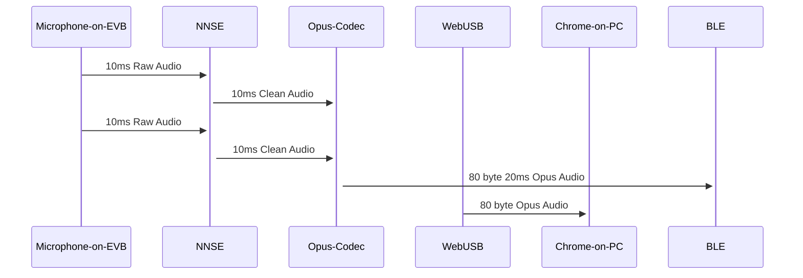

# Speech-Enhancing Bluetooth Microphone Demo
This example shows how to use [Ambiq's NNSE](https://github.com/AmbiqAI/nnse) to create a 'Speech Enhancing BLE Microphone'. NNSE is Ambiq's AI speech de-noiser, a real-time AI model that removes background noise (such as the noise from a hair-dryer) from human speech.



The demo needs a WebUSB-enabled device (Apollo5, Apollo4 Plus KXR/KBR Blue), a microphone, and a PC or laptop running Chrome. It supports both PDM and AUDADC microphones, but is configured for PDM by default. To switch to AUDADC, uncomment this line in nnse_usb/src/nnse_usb.cc:

```c
// #define USE_AUDADC // Uncomment this to use the AUDADC instead of the PDM
``````

Running the demo.

First, flash
```bash
$> make clean
$> make -j
$> make TARGET=nnse deploy
```

With the firmware deploy, follow this link on a PC using the Chrome browser: [Audio WebBLE Demo](https://ambiqai.github.io/web-ble-dashboards/audio/)

The webpage should look something like this:


Click on the 'Pair and start listening...' button to bring up a list of compatible bluetooth devices - one should be labeled 'Packet': that is the BLE device created by the NNSE firmware. Once paired, the web dashboard will play the audio (click the play button to allow the browser to actually play the stream) and show corresponding waveforms and spectrograms.

Once everything is working and audio is streaming, you can turn de-noising on and off by pressing Button0 on the EVB.

### Recommendations

The EVB's microphone will pick up the audio being played by the PC, often leading to a feedback loop. We recommend using headphones connected to the laptop to prevent this feedback.

For a more effective demonstration, use noise-cancelling headphones and introduce noise to the environment such as a hair dryer, traffic noise, or similar. The noise cancelling headphones should remove most of this ambient noise. When the EVB is in raw audio mode (as mentioned above, you can switch between modes using Button0 on the EVB), the EVB microphone's audio will be passed to the headphones, and the user will hear the ambient noise. When the EVB is in speech de-noising mode, the ambient noise will be removed but any speech will be cleaned up and passed through to the user's headphones.
