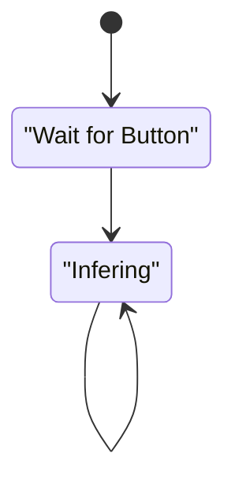

# Deploying EdgeImpulse Models using neuralSPOT Nests

NeuralSPOT Nests are a way to package its components in a self-contained software distribution. They include every static library and header file needed to get a neuralSPOT-based AI application compiled into a deployable binary. Nests are intended to be starting points for endpoint AI feature development, but often have to be modified to work other software packages, which typically have their own conventions, components, and libraries.

In this article, we walk through  how to use neuralSPOT Nests to deploy one such external software package (EdgeImpulse C++ models) onto Apollo4 Plus. 

## EdgeImpulse C++ Models

[EdgeImpulse](https://www.edgeimpulse.com) is a [low-code](https://en.wikipedia.org/wiki/Low-code_development_platform) AI SaaS which is popular for developing endpoint AI models. It offers many ways to get a trained model onto endpoint devices. In our case, we'll be using their [Generic C++ Deployment](https://docs.edgeimpulse.com/docs/deployment/running-your-impulse-locally/deploy-your-model-as-a-c-library) approach.


> *TL;DR* If you want to skip to the solution, see our [EdgeImpulse examples](https://github.com/AmbiqAI/neuralSPOT/tree/main/projects/edgeimpulse) directory.

In this article, we'll focus on the third step: integrating to Nests.

EdgeImpulse C++ models follow a similar approach to Nests - they're basically a code blob with everything you need to get a model running. All the user needs to do is figure out how to compile them for their target environment. Because of this, they include some components that Nests also include, such as CMSIS and Tensorflow libraries.

## Integration Flow

Generally speaking, there are four things we need to do to get an EdgeImpulse C++ model integrated into a Nest:

- Implement EdgeImpulse's porting hooks
- Compiling: adding EdgeImpulse and resolving conflicting SW components
- Connect the model to Apollo4 data sources (i.e. sensors)
- Implement the application loop

### Porting Hooks

This is a very common task for embedded development. Unlike most target platforms, embedded software developers can't rely on standard implementations of common software features such as printing, allocating memory, and timers. This is typically addressed by having a 'port me' section of code. 

EdgeImpulse's generic model requires that we implement the following functions:

```c
uint64_t ei_read_timer_ms();
uint64_t ei_read_timer_us();
void ei_printf(const char *format, ...);
void ei_printf_float(float f);
void *ei_malloc(size_t size);
void *ei_calloc(size_t nitems, size_t size);
void ei_free(void *ptr);
```

Fortunately, neuralSPOT has implementations for all of these, so the porting effort is a simple matter - the code is [here](https://github.com/AmbiqAI/neuralSPOT/tree/main/projects/edgeimpulse/src/ambiq).

> *NOTE* Embedded applications are often allergic to dynamic memory allocation because they may introduce non-deterministic delays that conflict with real-time behavior. NeuralSPOT's core functionality avoids dynamic memory allocation, but it does provide an implementation based on FreeRTOS's heap4 implementation, which is a good compromise between functionality and real-time behavior.

### Compiling and Resolving Conflicts

Compiling an EdgeImpulse-based application is a matter of adding the downloaded C++ code to the Nest and modifying the default Nest makefile to include the new code and eliminate conflicts

The Nest includes a Makefile that compiles the default Nest application (basic_tf_stub) and links in the entirety of neuralSPOT (don't worry, only used components make it into the final binary).

> *NOTE* We structured the EdgeImpulse example directories included in neuralSPOT such many example models share Makefiles and ported code, but we kept each downloaded C++ model exactly as downloaded from EdgeImpulse.

#### Modifying the Makefile

The Nest makefile is pretty straightforward - the key to understanding how to modify it is that it is designed to compile every source file added to the `sources` variable. The are 3 sets of directories we add in our final, modified [Makefile](https://github.com/AmbiqAI/neuralSPOT/blob/main/projects/edgeimpulse/Makefile):

- The application directory (containing the main() loop) (for [example](https://github.com/AmbiqAI/neuralSPOT/tree/main/projects/edgeimpulse/ei_yes_no))
- The Ambiq-EdgeImpulse [ported code directory](https://github.com/AmbiqAI/neuralSPOT/tree/main/projects/edgeimpulse/src)
- And all the directories in the downloaded EdgeImpulse model and SDK (lots)

#### Resolving Conflicts

Both EdgeImpulse and neuralSPOT include CMSIS and Tensorflow libraries. If you try compiling and linking EdgeImpulse as a Nest application without modification, you'll get "redefined" complaints from the linker. The best approach here is to whittle down neuralSPOT to include only the libraries you need.

The easiest way to do this is by modifying the Nest's `autogen.mk` file (which may cause confusion, so it might be a good idea to rename it after modifying it). Our modified and renamed file is [`ns_for_ei.mk`](https://github.com/AmbiqAI/neuralSPOT/blob/main/projects/edgeimpulse/make/ns_for_ei.mk).

An unmodified Nest `autogen.mk` file specifies the include path for the compilation step, and list of libraries to be linked in by the linker. 

To resolve conflicts, we removed the includes for CMSIS and Tensorflow, bolded below.

<pre>
INCLUDES += neuralspot/ns-core/includes-api neuralspot/ns-harness/includes-api neuralspot/ns-peripherals/includes-api neuralspot/ns-ipc/includes-api neuralspot/ns-audio/includes-api neuralspot/ns-usb/includes-api neuralspot/ns-utils/includes-api neuralspot/ns-rpc/includes-api neuralspot/ns-i2c/includes-api extern/AmbiqSuite/R4.3.0/boards/apollo4p_evb/bsp extern/AmbiqSuite/R4.3.0/CMSIS/AmbiqMicro/Include
extern/AmbiqSuite/R4.3.0/devices
extern/AmbiqSuite/R4.3.0/mcu/apollo4p
extern/AmbiqSuite/R4.3.0/mcu/apollo4p/hal/mcu 
extern/AmbiqSuite/R4.3.0/utils extern/AmbiqSuite/R4.3.0/third_party/FreeRTOSv10.1.1/Source/include extern/AmbiqSuite/R4.3.0/third_party/FreeRTOSv10.1.1/Source/portable/GCC/AMapollo4 extern/AmbiqSuite/R4.3.0/third_party/tinyusb/src extern/AmbiqSuite/R4.3.0/third_party/tinyusb/src/common extern/AmbiqSuite/R4.3.0/third_party/tinyusb/src/osal extern/AmbiqSuite/R4.3.0/third_party/tinyusb/src/class/cdc extern/AmbiqSuite/R4.3.0/third_party/tinyusb/src/device
<b>extern/CMSIS/CMSIS_5-5.9.0/CMSIS/Core/Include
extern/CMSIS/CMSIS_5-5.9.0/CMSIS/NN/Include
extern/CMSIS/CMSIS_5-5.9.0/CMSIS/DSP/Include
extern/CMSIS/CMSIS_5-5.9.0/CMSIS/DSP/PrivateInclude
extern/tensorflow/0c46d6e/. 
extern/tensorflow/0c46d6e/third_party extern/tensorflow/0c46d6e/third_party/flatbuffers/include</b>
extern/SEGGER_RTT/R7.70a/RTT extern/SEGGER_RTT/R7.70a/Config
extern/erpc/R1.9.1/includes-api
</pre>

We also remove the conflicting static libraries:

<pre>
libraries += libs/ns-harness.a libs/ns-peripherals.a libs/ns-ipc.a libs/ns-audio.a libs/ns-usb.a libs/ns-utils.a libs/ns-rpc.a libs/ns-i2c.a libs/ambiqsuite.a libs/segger_rtt.a libs/erpc.a libs/libam_hal.a libs/libam_bsp.a <b>libs/libCMSISDSP.a libs/libcmsis-nn.a libs/libtensorflow-microlite-o2.a</b>
</pre>

### Connecting to Apollo4 Data Sources

Endpoint AI typically operates on data collected by sensors, so we have to connect Apollo4's sensors (e.g. audio ADC) to the EdgeImpulse model. In practice, these means we have:

- Read the sensor data at rate/frquency expected by the model
- Convert it to the format expected by the model
- Feed it to the model

Fortunately, both neuralSPOT and EdgeImpulse have put a lot of design effort into making this easy.

> *TL;DR* If you want to jump straight to the solution, see [here](https://github.com/AmbiqAI/neuralSPOT/blob/main/projects/edgeimpulse/ei_yes_no/src/main.cc) for an audio example, and [here](https://github.com/AmbiqAI/neuralSPOT/blob/main/projects/edgeimpulse/ei_anomaly_detection/src/main.cc) for an accelerometer example.

We'll use an audio-based AI model to walk through how to do this.

To collect audio, we use neuralSPOT ns-audio library. For this specific model, we configure ns-audio to use callbacks, one channel, 16kHz sampling, and 8 slices per window (for continuous inference):

```c
// Audio Configuration
// High level audio parameters
#define NUM_CHANNELS 1
#define SAMPLE_RATE 16000
#define EI_CLASSIFIER_SLICES_PER_MODEL_WINDOW 8

//  Callback function declarations
static int get_signal_data(size_t offset, size_t length, float *out_ptr);
void audio_frame_callback(ns_audio_config_t *config, uint16_t bytesCollected);

// Audio IPC and config
int16_t static g_in16AudioDataBuffer[2][EI_CLASSIFIER_SLICE_SIZE]; // 1s
uint8_t static g_bufsel = 0; // for pingponging
bool volatile static g_audioRecording = false;
bool volatile static g_audioReady = false;

ns_audio_config_t audio_config = {
    .eAudioApiMode = NS_AUDIO_API_CALLBACK,
    .callback = audio_frame_callback,
    .audioBuffer = (void *)&g_in16AudioDataBuffer,
    .eAudioSource = NS_AUDIO_SOURCE_AUDADC,
    .numChannels = NUM_CHANNELS,
    .numSamples = EI_CLASSIFIER_SLICE_SIZE,
    .sampleRate = SAMPLE_RATE,
    .audioSystemHandle = NULL, // filled in by audio_init()
    .bufferHandle = NULL
};
```


We need to define two callbacks - one for ns-audio to handle incoming audio samples, and the other for EdgeImpulse to give it access to those samples. Both are very straight-forward:

```c
// EdgeImpulse Callback: fill a section of the out_ptr buffer when requested
static int get_signal_data(size_t offset, size_t length, float *out_ptr) {
    numpy::int16_to_float(&g_in16AudioDataBuffer[g_bufsel^1][offset], out_ptr, length);
    return EIDSP_OK;
}

// ns-audio callback
void audio_frame_callback(ns_audio_config_t *config, uint16_t bytesCollected) {
    uint32_t *pui32_buffer =
        (uint32_t *)am_hal_audadc_dma_get_buffer(config->audioSystemHandle);

    if (g_audioRecording) {
        for (int i = 0; i < config->numSamples; i++) {
            g_in16AudioDataBuffer[g_bufsel][i] = (int16_t)(pui32_buffer[i] & 0x0000FFF0);
            if (i == 4) {
                // Workaround for AUDADC sample glitch, here while it is root caused
                g_in16AudioDataBuffer[g_bufsel][3] = (g_in16AudioDataBuffer[g_bufsel][2]+g_in16AudioDataBuffer[g_bufsel][4])/2; 
            }            
        }
        g_audioReady = true;
        g_bufsel ^=1; // pingpong
    }
}
```

### Implementing the Application Loop

The application loop is very simple, barely worth a state diagram.



The infering state is made a bit more complex because this model implements 'continuous inference' - that is, instead of waiting for a full sample to be collected, it slides a window across audio samples and infers for every window. In practice, the model will usually infer over roughly the same audio multiple times: if the audio is "...yes...", the model may see "..y", then ".ye", then ".yes", and so on.

In order to prevent multiple "yes" inference results for the same utterance, the application implements a moving average filter, and only print out a classification result if the average certainty of a classification result remains above a threshold:

```c
res = run_classifier_continuous(&signal, &result, false);

// Continuous classfication slices the audio into windows it
// slides across the samples. For best results, we calculate
// a moving average across the last 10 inferences (1.125s)

y = updateFilter(&yesFilter, result.classification[3].value);
n = updateFilter(&noFilter, result.classification[0].value);
if (y>0.6) ns_lp_printf("Y");       // Strong Yes
  else if (y>0.4) ns_lp_printf("y");  // Probably Yes
if (n>0.6) ns_lp_printf("N");       // Strong No
  else if (n>0.4) ns_lp_printf("n");  // Probably No
```


# Just the Beginning

The beauty integrating development platforms such as neuralSPOT and EdgeImpulse is that once the initial integration is down, developing, deploying, and updating models becomes much easier - instead of struggling with integration details, the AI developer is freed to focus on the core challenges of AI - collecting and refining data and improving model accuracy.