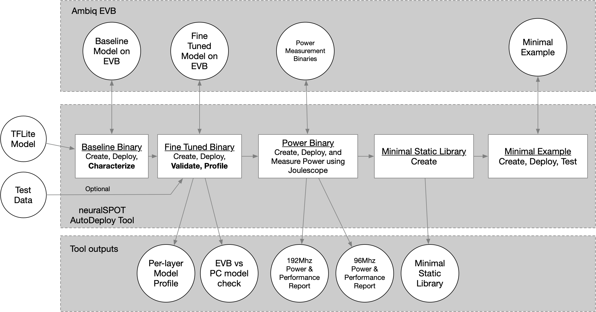

# From TF to EVB - testing, profiling, and deploying AI models

Developing AI models is hard. Deploying them on embedded devices is also hard. Developing AI features for embedded devices requires doing both of these hard things over and over again until everything is working and optimized. Fortunately, Ambiq's neuralSPOT Autodeploy tool is here to help.

Autodeploy is an Ambiq-specific tool which automates the creation, deployment, validation, and profiling of TFlite models on embedded platforms.

## The Old Way of Doing Things

Developing an AI feature typically involves a repetitive process: 

1. An AI developer produces a model that implements the feature more or less optimally
2. That model is converted to code that can execute on an EVB. This is a complex process that requires manually generating new code every time the model changes.
3. That code is deployed and tested on the EVB. Problems may arise from numeric mismatches, memory issues, and performance (latency) issues.
4. The AI developer analyses and debugs any issues, tweaks the model in an attempt to mitigate them, and jumps back to step 1.

Each of of these steps is mostly manual, complex, and fraught with the potential for coding errors.

Fortunately, all the information needed to automate the middle 2 steps is tucked in Tensorflow's representation of the model - all that is needed is a convenient way to extract it, and an automation flow that takes advantage of that info.

# Ambiq's AutoDeploy is Here to Help

AutoDeploy is a tool that speeds up the AI/Embedded iteration cycle by automating most of the tedious bits - given a TFLite file, the tool will convert it to code that can run on an Ambiq EVB, then run a series of tests to characterize its embedded behavior. It then generates a minimal static library suitable implementing the model for easy integration into applications.



### Pain Points

AutoDeploy was designed to address many common pain points:

- Code Generation Pain
  - Automatically figures out the right Tensor Arena, Resource Variable Arena, and Profile Data sizes
  - Produces a minimal TFLite for Microcontroller instance by determining which Ops are actually needed and only including those
- Model Behavior Mismatches
  - AutoDeploy runs the same model inputs on the PC and EVB, and compares the results, leading to early discovery and easier debugging of behavior differences. Configuration of the model, input/output tensors, and statistics gathering are driven by AutoDeploy using RPC.
- Model Performance Profiling
  - AutoDeploy extends the TFLite for Microcontrollers Profiling to produce detailed reports including per-layer latency, MAC count, and cache and CPU performance statistics.
- Model Power Usage Profiling
  - If a Joulescope is available, AutoDeploy can use it to automatically measure the model inference power consumption.


# Using AutoDeploy

Using AutoDeploy is easy - just give it a TFLite model, connect an EVB, and let it go to work:

```bash
$> cd tools
$> python -m ns_autodeploy --tflite-filename=mymodel.tflite --model-name mymodel --measure-power
```

As part of the process, AutoDeploy generates a number of artifacts, including three ready-to-deploy binary files and the source code used to generate them:

```bash
.../projects/autodeploy
	./mymodel
			./mymodel
					./lib # minimal static library and API header
					./src # tiny example that compiles the lib into an EVB image
			./tflm_validator
					./src # Highly instrumented model validation application (leverages USB and RPC)
			./mymodel_power
					./src # Power measurement application (requires Joulescope and GPIO connections)
			mymodel.csv # Per-layer profile
			mymodel_mc.pkl # artifact generated during validation, useful for non-USB EVBs
			mymodel_md.pkl # artifact generated during validation, useful for non-USB EVBs
			
```
The `mymodel.csv` file contains a CSV representation of per-layer profiling stats. For a KWS, for example, the CSV contains the following:

| Event | Tag | uSeconds| Est MACs| cycles| cpi| exc| sleep| lsu| fold| daccess| dtaglookup| dhitslookup| dhitsline| iaccess| itaglookup| ihitslookup| ihitsline |
| ------| ------|------|------|------|------|------|------|------|------|------|------|------|------|------|------|------|------ |
|0| CONV_2D| 47794| 320000| 9176380| 141| 252| 0| 188| 166| 58335| 55777| 0| 2558| 1220789| 357761| 0| 863028 |
|1| DEPTHWISE_C| 23334| 72000| 4480072| 153| 54| 0| 200| 123| 30068| 25311| 0| 4757| 625707| 175380| 0| 450327 |
|2| CONV_2D| 44674| 512000| 8577368| 168| 102| 0| 96| 194| 81745| 80093| 0| 1652| 1087045| 309917| 0| 777128 |
|3| DEPTHWISE_C| 23337| 72000| 4480468| 74| 147| 0| 77| 126| 30072| 25311| 0| 4761| 625704| 175399| 0| 450305 |
|4| CONV_2D| 44671| 512000| 8578178| 1| 120| 0| 21| 195| 81736| 80070| 0| 1666| 1086915| 309928| 0| 776987 |
|5| DEPTHWISE_C| 23328| 72000| 4478896| 44| 99| 0| 225| 122| 30059| 25301| 0| 4758| 625584| 175343| 0| 450241 |
|6| CONV_2D| 44676| 512000| 8576362| 83| 135| 0| 27| 195| 81736| 80079| 0| 1657| 1086955| 309892| 0| 777063 |
|7| DEPTHWISE_C| 23336| 72000| 4478996| 85| 238| 0| 165| 118| 30067| 25313| 0| 4754| 625660| 175393| 0| 450267 |
|8| CONV_2D| 44675| 512000| 8577472| 118| 184| 0| 161| 196| 81745| 80092| 0| 1653| 1087073| 309922| 0| 777151 |
|9| AVERAGE_POO| 583| 0| 111772| 100| 169| 0| 39| 197| 202| 177| 0| 25| 60827| 1541| 0| 59286 |
|10| RESHAPE| 21| 0| 3748| 213| 74| 0| 219| 1| 31| 24| 0| 7| 422| 142| 0| 280 |
|11| FULLY_CONNE| 134| 768| 25644| 69| 76| 0| 249| 21| 275| 263| 0| 12| 3014| 911| 0| 2103 |
|12| SOFTMAX| 85| 0| 17574| 227| 231| 0| 24| 43| 102| 63| 0| 39| 2552| 717| 0| 1835 |

This information is collected from a number of sources based on both static analysis on the PC and dynamic profiling on the EVB:
Dynamically collected statistics are:
1. The Tag and uSeconds come from TFLM's micro-profiler and is collected by TFLM during the first inference only
1. The cycles, cpi, exc, sleep, lsu, and fold come from Arm's ETM profiling registers and are measured during the first inference only
1. The daccess, dtaglookup, dhitslook, dhitsline, iaccess, itagelookup, ihitslookup, and ihitsline come from Ambiq cache profiling module and are measured during the first inference only

Estimated MACs are based on a static analysis of the TFLite file and are calculated as the theoretical MAC per layer type and shape.

## Measuring Power
AutoDeploy can use a Joulescope to measure power. It does so by:
1. Creating and deploying a power measurement binary to the EVB
2. Triggering a number of inference operations by using the Joulescope's GP0out bin (which is monitored by the EVB)
3. Waiting for certain patterns on the Joulescope's GPIn pins to know when the inference code is running
4. Using Joulescope's python driver to sample power measurements during that time.

It will do this twice, once for 96Mhz and another for 192Mhz.

### Requirements
1. A Joulescope
2. Connections between the Joulescope's GPIn and GPOut pins and the appriopriate GPIO pins (see the wiring guide below)

### Connecting the Joulescope to the EVB
1. Power connections (follow EVB power measurement connection guide)
2. EVB Pin 22 to Joulescope In0
2. EVB Pin 23 to Joulescope In1
4. EVB Pin 24 to Joulescope Out0

### Procedure
1. Plug in EVB and Joulescope
2. Start the Joulescope desktop application to power on the device
3. Stop the Joulescope desktop application in order to allow the Python driver to control the Joulescope instead
4. Run the power measurement script

*NOTE*: AutoDeploy needs characterization information to create the power binary - this data can be obtained by running AutoDeploy's profiling step (it will run by default),
or it can be loaded from a previous run (see the Apollo4 Lite section below for one scenario in which this is necessary).

### Result Output
```
Charcterization Report for har:
[Profile] Per-Layer Statistics file:         har_stats.csv
[Profile] Max Perf Inference Time (ms):      355.427
[Profile] Total Estimated MACs:              3465792
[Profile] Total CPU Cycles:                  68241382
[Profile] Total Model Layers:                17
[Profile] MACs per second:                   9751065.620
[Profile] Cycles per MAC:                    19.690
[Power]   Max Perf Inference Time (ms):      20.249
[Power]   Max Perf Inference Energy (uJ):    189.257
[Power]   Max Perf Inference Avg Power (mW): 9.346
[Power]   Min Perf Inference Time (ms):      20.110
[Power]   Min Perf Inference Energy (uJ):    190.665
[Power]   Min Perf Inference Avg Power (mW): 9.481

Notes:
        - Statistics marked with [Profile] are collected from the first inference, whereas [Power] statistics
          are collected from the average of the 100 inferences. This will lead to slight
          differences due to cache warmup, etc.
        - CPU cycles are captured via Arm ETM traces
        - MACs are estimated based on the number of operations in the model, not via instrumented code
```


## Profiling Apollo4 Lite
Apollo4 Lite doesn't have a USB port, which is needed by AutoDeploy to fine-tune and profile the model. Furthermore, the data collected from these steps is needed when creating the power measurement binary and minimal library. In order to enable power measurement and library generation on Apollo4 Lite, AutoDeploy is capable of generating the required metadata by profiling the model on Apollo4 Plus and saving it for subsequent use on Apollo4 Lite. 

### Requirements
To measure power and generate model libraries for Apollo4 Lite, you'll need:
1. An Apollo4P or Apollo4P Blue EVB
2. An Apollo4 Lite
3. A Joulescope (to measure power)

### Procedure
The overall procedure is:
1. Run characterization on Apollo4 Plus or Blue Plus EVB, which generates the required metadata
2. Switch the EVB to Apollo4 Lite
3. Run just the library generation and/or power measurement steps on Apollo4 Lite

Using the human activity recognition model as an example, this procedure translates to something like the following steps.

```bash
cd .../neuralSPOT/tools
# Plug in Apollo4 Plus or Blue Plus EVB
vi ../make/local_overrides.mk # uncomment the BOARD:=apollo4p line, comment out all other BOARD settings in this file

python -m ns_autodeploy --model-name har --tflite-filename har.tflite --runs 3 --no-create-library # small number of runs and skip creating the library to save time
# Wait for successful completion of script

ls ../projects/autodeploy/har
# check for existence of har_md.pkl and har_mc.pkl

# Switch the Apollo4P EVB for the Apollo4 Lite EVB, including Joulescope GPIO cables if needed

vi ../make/local_overrides.mk # uncomment the BOARD:=apollo4l line, comment out all other BOARD settings in this file

python -m ns_autodeploy --model-name har --tflite-filename har.tflite --runs 3 --measure-power --no-create-binary --no-create-profile # Skip fine-tuning and profiling steps on AP4 Lite
# Wait for successful completion of script
```
