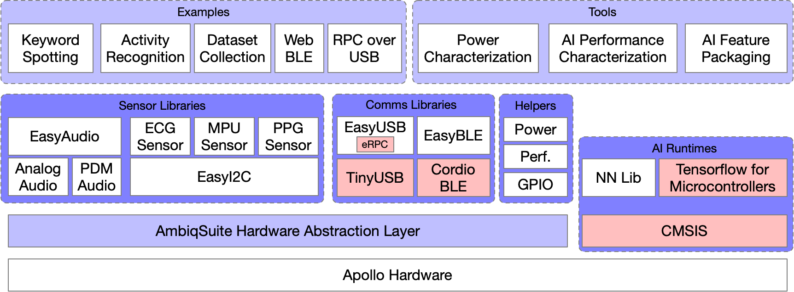
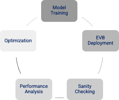
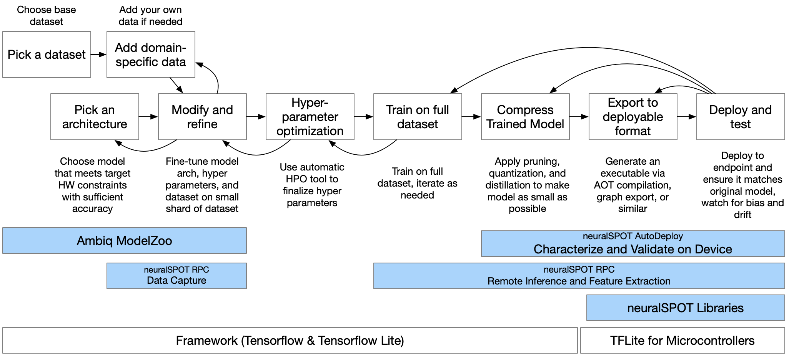

# Welcome to neuralSPOT
#### Because AI is hard enough.
neuralSPOT is an AI developer-focused SDK in the true sense of the word: it includes everything you need to get your AI model onto Ambiq’s platform. You’ll find libraries for talking to sensors, managing SoC peripherals, and controlling power and memory configurations, along with tools for easily debugging your model from your laptop or PC, and examples that tie it all together.

<p align="center">

</p>

## Major Components
NeuralSPOT consists of the neuralspot libraries, required external components, tools, and examples.

<p align="center">

</p>
The directory structure reflects the code structure:

```
/neuralspot - contains all code for NeuralSPOT libraries
	/neuralspot # neuralSPOT's libraries
	/extern     # External dependencies, including TF and AmbiqSuite
	/examples   # Example applications, each of which can be compiled to a deployable binary
	/projects   # Examples of how to integrate external projects such as EdgeImpulse models
	/make       # Makefile helpers, including neuralspot-config.mk and local_overrides.mk
	/tools	    # AutoDeploy and RPC python-based tools
	/tests      # Simple compatibility tests
	/docs       # introductory documents, guides, and release notes
```

### Libraries
neuralSPOT contains Ambiq-specific embedded libraries for [audio](https://github.com/AmbiqAI/neuralSPOT/tree/main/neuralspot/ns-audio), [USB](https://github.com/AmbiqAI/neuralSPOT/tree/main/neuralspot/ns-usb), [BLE](https://github.com/AmbiqAI/neuralSPOT/tree/main/neuralspot/ns-ble), [i2c](https://github.com/AmbiqAI/neuralSPOT/tree/main/neuralspot/ns-i2c) peripherals, [power management](./optimizing_using_neuralspot.md), numerous helper functions such as [interprocess communications](https://github.com/AmbiqAI/neuralSPOT/tree/main/neuralspot/ns-ipc), [memory management](https://github.com/AmbiqAI/neuralSPOT/tree/main/neuralspot/ns-utils) and [many more](features.md).

### Tools
neuralSPOT offers [remote procedure call support](https://github.com/AmbiqAI/neuralSPOT/tree/main/neuralspot/ns-rpc) to ease cross-platform development. This enables scenarios such as running inference on a laptop using data collected on the EVB, or conversely, feeding data to a model deployed on the EVB. For example, neuralSPOT's [AutoDeploy Tool](https://github.com/AmbiqAI/neuralSPOT/tree/main/tools) uses RPC to automatically deploy, test, and profile TFLite models on Ambiq devices.

### Examples
neuralSPOT includes real-world [AI examples](https://github.com/AmbiqAI/neuralSPOT/tree/main/examples) demonstrating the use of its features, and sample drivers for external peripherals. Beyond that, Ambiq’s [ModelZoo](https://github.com/AmbiqAI/neuralSPOT/blob/main/docs/Ambiq-ModelZoo.md) is built on NeuralSPOT, giving developers powerful templates to start building AI models from.

## Intended Use
There is no one way to develop and deploy AI, so NeuralSPOT makes as few assumptions as possible. There are three principal ways in which it is [intended to be used](./Developing_with_NeuralSPOT.md):

<p align="center">

</p>

1. Develop the deployed model as a standalone application, to be integrated after it is working and optimized.
2. Develop the model source code as a component in an existing application.
3. Export a linkable, minimal self-contained static library ready to integrate into an existing application.

In order to support these scenarios, NeuralSPOT includes everything needed to get your model running, including curated versions of AmbiqSuite and Tensorflow Lite for Microcontrollers. 

### The Nest

The Nest is an automatically created directory with everything you need to get TF and AmbiqSuite running together and ready to start developing AI features for your application. It is created for your specific target device and only includes needed header files and static libraries, along with a basic example application stub with a `main()`. It is designed be be used in either of the two ways listed above - see our [Nest guide](./Developing_with_NeuralSPOT.md) for more details.

## Navigating the NeuralSPOT Repository
NeuralSPOT lives on GitHub as an open-source, highly collaborative project which includes code, documentation, licenses, collaboration guides - in short, everything needed to get started.

- The [main repo](https://github.com/AmbiqAI/neuralSPOT) is a useful place to get started.
- Our development flow is based on Nests, described [here](./Developing_with_NeuralSPOT.md).
- The examples documents how to [integrate TF Lite for Microcontrollers](https://github.com/AmbiqAI/neuralSPOT/tree/main/examples/basic_tf_stub), how to set up and use our [debug tools](https://github.com/AmbiqAI/neuralSPOT/blob/main/examples/rpc_client/rpc-client.md) (and [here](https://github.com/AmbiqAI/neuralSPOT/tree/main/examples/rpc_server)), and how to instantiate our [various](https://github.com/AmbiqAI/neuralSPOT/tree/main/examples/s2i) [drivers](https://github.com/AmbiqAI/neuralSPOT/blob/main/examples/har/har.md).
- The [neuralSPOT libraries](https://github.com/AmbiqAI/neuralSPOT/tree/main/neuralspot) each have detailed documentation for how to use them.
- For those interesting in contributing to neuralSPOT or adapting it to their projects, we have a [Developers Guide](https://github.com/AmbiqAI/neuralSPOT/blob/main/docs/developer_guide.md).
- Finally, the code is [documented](https://github.com/AmbiqAI/neuralSPOT/blob/main/docs/docs/html/index.html) (it's HTML, so you'll have to clone the repo because GitHub won't render it).

## Using neuralSPOT
### A Day in the Life of an AI Developer
neuralSPOT is designed to help with the tedious parts of AI feature development, with tools for every stage of the process.


1. **Discovery and Exploration**: early in the AI development cycle, data scientists will explore existing literature, research available datasets, experiment with neural architectures. They typically write software to automate and accelerate each of these stages. NeuralSPOT can help at this stage:
    1. [Ambiq's ModelZoo](Ambiq-ModelZoo.md): a set of robust starting points for many classes of AI models, including speech interfaces, health and fitness, and more.
    2. [neuralSPOT RPC](../neuralspot/ns-rpc/README.md): public datasets are a good starting point, but they usually need to be augmented with data collected from the actual sensor that will be used (and perhaps the actual physical location and configuration as well). NeuralSPOT's RPC capabilities make it easier to collect this data using an EVB talking to the sensor and sending it directly to Python scripts on the PC. See our [MPU Data Capture](https://github.com/AmbiqAI/neuralSPOT/tree/main/examples/mpu_data_collection) and [Audio Data Capture](https://github.com/AmbiqAI/neuralSPOT/tree/main/examples/rpc_client) examples for a guide on how this can be done.
2.  **Fine-Tuning for Deployment**: at this stage, the data science team has a pretty good idea of what the final AI model will look like, and will start the process of compressing it and porting it from Python to the actual hardware. NeuralSPOT can help here too:
    1. **Model Conversion**: TFLite models need to be converted to C++ and paired with the Tensorflow Lite for Microcontrollers (TFLM) runtime. [NeuralSPOT's Autodeploy](./From%20TF%20to%20EVB%20-%20testing,%20profiling,%20and%20deploying%20AI%20models.md) tools help with what can be a tedious and error-prone process.
    2. **Model Validation**: Even when theoretically identical, models running on Python may differ from the same model running on TFLM due to numeric differences. NeuralSPOT's Autodeploy includes the ability to compare the outputs of models by running the same input tensor on both Python and the EVB and comparing the results.
    1. **Feature Extraction Development and Testing**: feature extraction (the calculation of input tensors from collected sensor data) can differ significantly between Python and EVB. NeuralSPOT's RPC capabilities can be used to compare the results across platforms.
    3. **Model Characterization and Profiling**: Getting the model to fit on an embedded platform usually involves multiple experiments where the model developer is trying different compression approaches to meet the desired memory, latency, and power constraints while maintaining the required accuracy. NeuralSPOT's Autodeploy automatically characterizes the model running on the EVB, producing per-layer timing, cache performance, and memory details. It will even measure power when paired with a Joulescope.
    5. **Model Export**: once a model is ready, NeuralSPOT's Autodeploy tool can automatically package it as a standalone static library or AmbiqSuite example for further integration.
1. **Application Development**: AI developers often have to create demonstrations applications for their models. These standalone applications may need to sample sensors or collect data via USB or BLE, process the data and feed it to an AI model, then present the results (again via BLE or similar). NeuralSPOT includes a rich library of softare components to help with the creation of these demos, wrapping many of Apollo's SoC peripherals in easy-to-use APIs. See our ['kitchen sink' KWS example](./Understanding-neuralSPOT-via-the-Basic-Tensorflow-Example.md) for one way to do this.