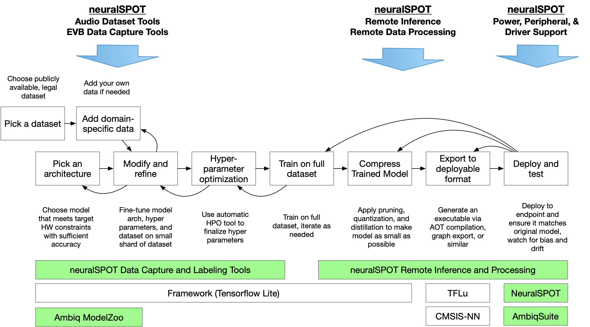

# Welcome to neuralSPOT
#### Because AI is hard enough.
neuralSPOT is an AI developer-focused SDK in the true sense of the word: it includes everything you need to get your AI model onto Ambiq’s platform. You’ll find libraries for talking to sensors, managing SoC peripherals, and controlling power and memory configurations, along with tools for easily debugging your model from your laptop or PC, and examples that tie it all together.

## Major Components
neuralSPOT includes tools, libraries, and examples to help get your AI features implemented, optimized, and deployed.

### Libraries

neuralSPOT contains Ambiq-specific embedded libraries for [audio](https://github.com/AmbiqAI/neuralSPOT/tree/main/neuralspot/ns-audio), [USB](https://github.com/AmbiqAI/neuralSPOT/tree/main/neuralspot/ns-usb), and [i2c](https://github.com/AmbiqAI/neuralSPOT/tree/main/neuralspot/ns-i2c) peripherals, [power management](./optimizing_using_neuralspot.md), and numerous helper functions such as [interprocess communications](https://github.com/AmbiqAI/neuralSPOT/tree/main/neuralspot/ns-ipc), and [memory management](https://github.com/AmbiqAI/neuralSPOT/tree/main/neuralspot/ns-utils).

### Tools
neuralSPOT offers [remote procedure call support](https://github.com/AmbiqAI/neuralSPOT/tree/main/neuralspot/ns-rpc) to ease cross-platform development. This enables scenarios such as running inference on a laptop using data collected on the EVB, or conversely, feeding data to a model deployed on the EVB.

### Examples
neuralSPOT includes real-world AI examples demonstrating the use of its features, and sample drivers for external peripherals. Beyond that, Ambiq’s ModelZoo is built on NeuralSPOT, giving developers powerful templates to start building AI models from.

## Intended Use
There is no one way to develop and deploy AI, so NeuralSPOT makes as few assumptions as possible. There are two principal ways in which it is [intended to be used](./Developing_with_NeuralSPOT.md):
1. Develop the deployed model as a standalone application, to be integrated after it is working and optimized.
2. Develop the model as a component in an existing application.

In order to support both scenarios, NeuralSPOT includes everything needed to get your model running, including library versions of AmbiqSuite and Tensorflow Lite for Microcontrollers. 

### The Nest

The Nest is an automatically created directory with everything you need to get TF and AmbiqSuite running together and ready to start developing AI features for your application. It is created for your specific target device and only includes needed header files and static libraries, along with a basic example application stub with a `main()`. It is designed be be used in either of the two ways listed above - see our [Nest guide](./Developing_with_NeuralSPOT.md) for more details.

## Navigating the NeuralSPOT Repository
NeuralSPOT lives on GitHub as an open-source, highly collaborative project which includes code, documentation, licenses, collaboration guides - in short, everything needed to get started.

- The [main repo](https://github.com/AmbiqAI/neuralSPOT) is a useful place to get started.
- Our development flow is based on Nests, described [here](./Developing_with_NeuralSPOT.md).
- The examples documents how to [integrate TF Lite for Microcontrollers](https://github.com/AmbiqAI/neuralSPOT/tree/main/examples/basic_tf_stub), how to set up and use our [debug tools](https://github.com/AmbiqAI/neuralSPOT/blob/main/examples/rpc_client_example/rpc-client.md) (and [here](https://github.com/AmbiqAI/neuralSPOT/tree/main/examples/rpc_server_example)), and how to instantiate our [various](https://github.com/AmbiqAI/neuralSPOT/tree/main/examples/s2i) [drivers](https://github.com/AmbiqAI/neuralSPOT/blob/main/examples/har/har.md).
- The [neuralSPOT libraries](https://github.com/AmbiqAI/neuralSPOT/tree/main/neuralspot) each have detailed documentation for how to use them.
- For those interesting in contributing to neuralSPOT or adapting it to their projects, we have a [Developers Guide](https://github.com/AmbiqAI/neuralSPOT/blob/main/docs/developer_guide.md).
- Finally, the code is [documented](https://github.com/AmbiqAI/neuralSPOT/blob/main/docs/docs/html/index.html) (it's HTML, so you'll have to clone the repo because GitHub won't render it).

## Using neuralSPOT
### A Day in the Life of an AI Developer
neuralSPOT is designed to help with the tedious parts of AI feature development, with tools for every stage of the process

AI features are rarely developed by a single developer. It takes a team of AI specialists, data specialist, and embedded application specialists working together to develop and deploy an accurate and robust AI feature. These roles are fuzzy and frequently overlap, but for purposes of this document lets define them as follows:

- The **_Data Specialist_** collects and curates datasets, and augments the data with appropriate noise and distortion. They may also be responsible for labeling, updating, merging, and visualizing datasets.
- The **_AI Specialist_** crafts an AI architecture in order to train a model to calculate the desired output (aka inference) based on input data. This model is usually written in a python-based framework such as PyTorch or Tensorflow. This developer is usually in charge of compressing the model using techniques such as quantization, pruning and distillation.
- The **_Application Specialist_** is in charge of instantiating the AI model, hooking it up to the platform’s sensor, invoking it, and interpreting the results. Model’s are typically instantiated using one of a handful of _runtimes_ such as Tensorflow Lite for Microcontrollers, but can also be written ‘by hand’, so to speak.

neuralSPOT is intended to help each of these developers.

### neuralSPOT for Data Specialists

Data Specialists can leverage neuralSPOT to ease collection of data from real sensors onto a remote device such as a PC, and to fine-tune sensor settings to get the data into the shape the AI specialist needs. They can also use it to test new datasets against deployed models.

See our [MPU Data Capture](https://github.com/AmbiqAI/neuralSPOT/tree/main/examples/mpu_data_collection) and [Audio Data Capture](https://github.com/AmbiqAI/neuralSPOT/tree/main/examples/rpc_client_example) examples for a guide on how this can be done.

### neuralSPOT for AI Specialists

AI Specialists frequently run into mismatches between a model’s behavior on a PC and on the embedded device - these mismatches arise from numeric differences (Python almost never matches C, and even when exclusively in the C domain, CPU architectures differ in how they treat certain number formats), algorithmic differences, and more. The AI specialist can leverage NeuralSPOT to compare the PC and EVB feature extraction, inference, and output analysis portions of their model to eliminate the need for exact matches. For example, an AI specialist might choose to use the embedded platform’s feature extraction code to feed the PC-sided inference model implementation. 

See our Instrumented Model (TODO) example for one way to use neuralSPOT's [RPC utilities](https://github.com/AmbiqAI/neuralSPOT/tree/main/neuralspot/ns-rpc) to accomplish this.

### neuralSPOT for Application Specialists

Application Specialists can use NeuralSPOT as a fast way to integrate an AI model into their application. They’ll typically leverage the ready-made Tensorflow Lite for Microcontroller [examples](https://github.com/AmbiqAI/neuralSPOT/tree/main/examples/basic_tf_stub), use the SDK’s audio and i2c drivers to rapidly integrate their data sources, and [optimize](./optimizing_using_neuralspot.md) for power, performance, and size after it all works.

See [Developing using neuralSPOT](./Developing_with_NeuralSPOT.md) for a discussion of how various workflows are supported.