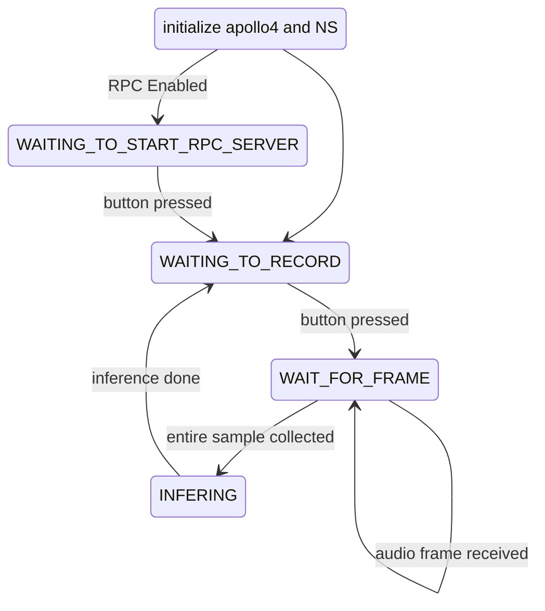

# Understanding neuralSPOT via the Basic Tensorflow Example
Often, the best way to ramp up on a new software library is through a comprehensive example - this is why neuralSPOT includes `basic_tf_stub`, an [illustrative example](https://github.com/AmbiqAI/neuralSPOT/tree/main/examples/basic_tf_stub) that illustrates many of neuralSPOT's features.

In this article, we walk through the example block-by-block, using it as a guide to building AI features using neuralSPOT.

> *Side Note* A "stub" in the developer world is a bit of code meant as a sort of placeholder, hence the example's name: it is meant to be code where you replace the existing TF (tensorflow) model and replace it with your own.

## Everything but the Kitchen Sink
Basic_TF_Stub is a deployable keyword spotting (KWS) AI model based on the [MLPerf KWS benchmark](https://github.com/mlcommons/tiny/tree/master/benchmark/training/keyword_spotting) - it grafts neuralSPOT's integration code into the existing model in order to make it a functioning keyword spotter.

The code uses the Apollo4's low audio interface to collect audio. Once collected, it processes the audio by extracting melscale spectograms, and passes those to a Tensorflow Lite for Microcontrollers model for inference. After invoking the model, the code processes the result and prints the most likely keyword out on the SWO debug interface. Optionally, it will dump the collected audio to a PC via a USB cable using RPC.

Along the way, this example uses many neuralSPOT features, including:

1. [ns-audio](https://github.com/AmbiqAI/neuralSPOT/tree/main/neuralspot/ns-audio) paired with the [AUDADC](https://github.com/AmbiqAI/neuralSPOT/blob/main/neuralspot/ns-audio/src/ns_audadc.c) or PDM driver to collect audio.
2. [ns-ipc](https://github.com/AmbiqAI/neuralSPOT/tree/main/neuralspot/ns-ipc) to use a ringbuffer to pass the audio to example application
3. [ns-mfcc](https://github.com/AmbiqAI/neuralSPOT/tree/main/neuralspot/ns-audio) to compute the mel spectogram
4. [ns-rpc](https://github.com/AmbiqAI/neuralSPOT/tree/main/neuralspot/ns-rpc) and [ns-usb](https://github.com/AmbiqAI/neuralSPOT/tree/main/neuralspot/ns-usb) to establish a remote procedure call interface to the development PC over a USB cable (optional)
5. [ns-power](https://github.com/AmbiqAI/neuralSPOT/tree/main/neuralspot/ns-peripherals) to easily set efficient power modes
6. [ns-peripherals](https://github.com/AmbiqAI/neuralSPOT/tree/main/neuralspot/ns-peripherals) to read the EVB buttons
7. ns-utils to provide energy measurement tools, along with malloc and timers for RPC

The code is structured to break out how these features are initialized and used - for example 'basic_mfcc.h' contains the init config structures needed to configure MFCC for this model.

> **NOTE** See here for instructions for how to build and run basic_tf_stub

## Code Structure

Basic_TF_stub, like every neuralSPOT example, is a standalone application - that is to say, it compiles into a binary file that can be uploaded to an Apollo4 evaluation board and executed. The entire application is defined in one file, basic_tf_stub.cc, which pulls in a series of header files structured to highlight how the used neuralSPOT components are instantiated and initialized. There are a lot of them, but they're all fairly short.

| Source File                                                  | Description                                       |
| ------------------------------------------------------------ | ------------------------------------------------- |
| [basic_tf_stub.cc](https://github.com/AmbiqAI/neuralSPOT/blob/main/examples/basic_tf_stub/src/basic_tf_stub.cc) | The main() application, includes everything else. |
| [basic_tf_stub.h](https://github.com/AmbiqAI/neuralSPOT/blob/main/examples/basic_tf_stub/src/basic_tf_stub.h) | Settings common to all header files |
| [basic_audio.h](https://github.com/AmbiqAI/neuralSPOT/blob/main/examples/basic_tf_stub/src/basic_audio.h) | Init structures and callbacks for ns-audio |
| [basic_mfcc.h](https://github.com/AmbiqAI/neuralSPOT/blob/main/examples/basic_tf_stub/src/basic_mfcc.h) | Init structures for MFCC library  |
| [basic_peripherals.h](https://github.com/AmbiqAI/neuralSPOT/blob/main/examples/basic_tf_stub/src/basic_peripherals.h) | Init structures for button and power settings |
| [basic_rpc_client.h](https://github.com/AmbiqAI/neuralSPOT/blob/main/examples/basic_tf_stub/src/basic_rpc_client.h) | Init structures for RPC system  |
| [basic_model.h](https://github.com/AmbiqAI/neuralSPOT/blob/main/examples/basic_tf_stub/src/basic_model.h) | Model-specific settings and init code |
| [kws_model_settings.h](https://github.com/AmbiqAI/neuralSPOT/blob/main/examples/basic_tf_stub/src/kws_model_settings.h) | KWS model settings (straight from MLPerf example) |
| [kws_model_data.h](https://github.com/AmbiqAI/neuralSPOT/blob/main/examples/basic_tf_stub/src/kws_model_data.h) | KWS model weights (straight from MLPerf example)  |

We'll walk through each component below.

## Code Walkthrough

The code is fairly straightforward, so this document will focus on explaining the trickier bits.

### Application-level Compile switches

| Switch          | What it Does                                                 |
| --------------- | ------------------------------------------------------------ |
| RPC_ENABLED     | Enables dumping audio samples to a PC via ns-rpc             |
| RINGBUFFER_MODE | Enables using ringbuffers for audio sample transfers. A simple ping-pong buffer is used otherwise. |
| ENERGY_MONITOR_ENABLE | Enables marking of different energy use domains via GPIO pins. This is intended to ease power measurements using tools such as Joulescope. |
| LOWEST_POWER_MODE | Disable all non-essential interfaces, including printf |
| NS_MLPROFILE | Measure AI performance using TFLM's microprofiler with neuralSPOT extensions |
| AUDIO_LEGACY | Uese pre-v2 audio library API |

### Basic_tf_stub.cc
The main application loop is a simple state machine:



The code is the best document, as usual, but some things to look out for while walking through it:

1. ns_core_init() should be called before other neuralSPOT init routines, as it sets neuralSPOT's initial global state.
2. Printing over the Jlink SWO interface messes with deep sleep in a number of ways, which are handled silently by neuralSPOT as long as you use ns wrappers printing and deep sleep as in the example.

> *NOTE* SWO interfaces aren't typically used by production applications, so power-optimizing SWO is mainly so that any power measurements taken during development are closer to those of the deployed system.

### Basic_tf_stub.h

This contains definitions used by the rest of the files. Of particular interest are the following `#defines`:

```c title="Audio Format Configuration"
/// High level audio parameters
#define NUM_CHANNELS 1
#define NUM_FRAMES 49 // 20ms frame shift
#define SAMPLES_IN_FRAME 320
#define SAMPLE_RATE 16000
```

These defines impact how we set up ns-audio and how we process the samples using ns-mfcc. MFCC works by moving a compute window over the audio sample (and in this example, we do that for every collected sample). SAMPLE_RATE, SAMPLES_IN_FRAME, and NUM_FRAMES are all related and are dictated by the particulars of the KWS model we used. In this case, SAMPLES_IN_FRAME are 16000/(49+1).

### Basic_audio.h

The basics of using the ns-audio are [straightforward](https://github.com/AmbiqAI/neuralSPOT/tree/main/neuralspot/ns-audio), but basic_audio.h can look complex because it demonstrates both NS_AUDIO_API_RINGBUFFER and NS_AUDIO_API_CALLBACK API modes.

For purposes of this tutorial, we'll walk through non-ringbuffer, non-legacy, single channel analog microphone audio mode.

First, we need to declare some buffers for the audio - there are 2: one where the raw  data is stored by the audio DMA engine, and another where we store the decoded PCM data. We also need to define an callback to handle DMA interrupts and move the data between the two buffers.

```c title="Audio buffers"
int16_t static audioDataBuffer[SAMPLES_IN_FRAME]; // incoming PCM audio data
alignas(16) uint32_t static dmaBuffer[SAMPLES_IN_FRAME * NUM_CHANNELS * 2];   // DMA target
am_hal_audadc_sample_t static workingBuffer[SAMPLES_IN_FRAME * NUM_CHANNELS]; // working buffer used
                                                                              // by AUDADC

static void audio_frame_callback(ns_audio_config_t *config, uint16_t bytesCollected) {
    if (audioRecording) { // global to set by the non-ISR main() control loop to start collecting audio data
        ns_audio_getPCM_v2(config, audioDataBuffer); // moves DMA data to audioDataBuffer
        audioReady = true; // global doorbell
    }
}
```

We also need to initialize the Audio config structure (which also serves as a handle once the system is initialized). Main() will pass this into ns_audio_init().

```c title="Audio configuration"
static ns_audio_config_t audio_config = {
    .api = &ns_audio_V2_0_0,
    .eAudioApiMode = NS_AUDIO_API_CALLBACK,
    .callback = audio_frame_callback,
    .audioBuffer = (void *)&audioDataBuffer,
    .eAudioSource = NS_AUDIO_SOURCE_AUDADC,
    .sampleBuffer = dmaBuffer,
    .workingBuffer = workingBuffer,
    .numChannels = NUM_CHANNELS,
    .numSamples = SAMPLES_IN_FRAME,
    .sampleRate = SAMPLE_RATE,
    .audioSystemHandle = NULL, // filled in by audio_init()
    .bufferHandle = NULL,
};
```

### Basic_MFCC.h

This one has a couple of hidden complexities worth exploring. In general, the parameters of this feature extractor are dictated by the model.

```c
// MFCC Config
#define MY_MFCC_FRAME_LEN_POW2  512 // Next power of two size after SAMPLES_IN_FRAME (320)
#define MY_MFCC_NUM_FBANK_BINS  40  // from model
#define MY_MFCC_NUM_MFCC_COEFFS 10  // from model

// Allocate memory for MFCC calculations
#define MFCC_ARENA_SIZE  32*(MY_MFCC_FRAME_LEN_POW2*2 + MY_MFCC_NUM_FBANK_BINS*(NS_MFCC_SIZEBINS+MY_MFCC_NUM_MFCC_COEFFS))
static uint8_t mfccArena[MFCC_ARENA_SIZE];

ns_mfcc_cfg_t mfcc_config = {
    .arena = mfccArena,
    .sample_frequency = SAMPLE_RATE,
    .num_fbank_bins = MY_MFCC_NUM_FBANK_BINS,
    .low_freq = 20,
    .high_freq = 4000, // from model
    .num_frames = NUM_FRAMES,
    .num_coeffs = MY_MFCC_NUM_MFCC_COEFFS,
    .num_dec_bits = 0,
    .frame_shift_ms = 20, // ignored
    .frame_len_ms = 30, // ignored
    .frame_len = SAMPLES_IN_FRAME,
    .frame_len_pow2 = MY_MFCC_FRAME_LEN_POW2
};
```

The other tricky bit is the `mfccArena`, which is used to store pre-calculated filters and temporary state. The ns-mfcc library maps a number of arrays to this memory block which translates to the messy sizing of the Arena (still better than the Tensorflow Lite Micro approach, which is 'guess and we'll tell you if you're right').
