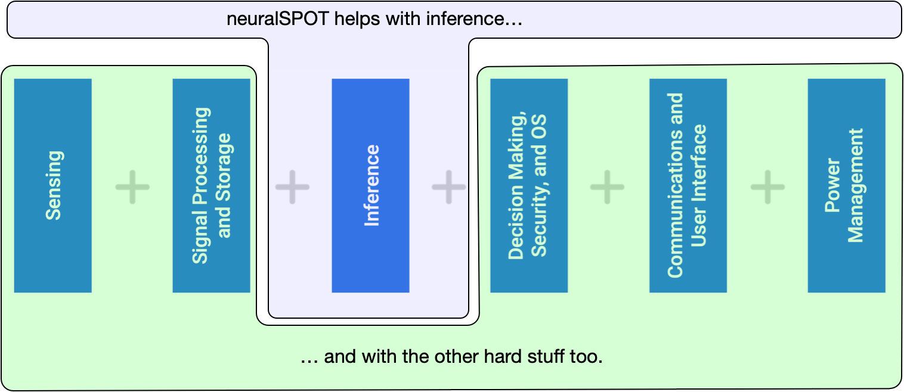

# AI and Ambiq

[Ambiq](https://ambiq.com) specializes [in ultra-low-power SoCs](https://ambiq.com/apollo4-plus/) designed to make intelligent battery-powered endpoint solutions a reality. These days, just about every endpoint device incorporates AI features, including fitness activity recognition, speech-driven user interfaces, audio event detection, health monitoring, and more.

Ambiq's [ultra low power, high-performance](https://github.com/AmbiqAI/MLPerfTiny/blob/main/docs/benchmark_results.md) platforms are ideal for implementing this class of AI features, and we at Ambiq are dedicated to making implementation as easy as possible by offering developer-centric toolkits, software libraries, and reference models to accelerate AI feature development.

## neuralSPOT - because AI is hard enough

neuralSPOT is an AI developer-focused SDK in the true sense of the word: it includes everything you need to get your AI model onto Ambiq’s platform. You’ll find libraries for talking to sensors, managing SoC peripherals, and controlling power and memory configurations, along with tools for easily debugging your model from your laptop or PC, and examples that tie it all together.

## Ambiq ModelZoo

Ambiq's ModelZoo is a collection of AI reference models built on neuralSPOT to help your team bootstrap AI model development and deployment on Apollo4 Plus. It includes open source models for speech interfaces, speech enhancement, and health and fitness analysis, with everything you need to reproduce our results and train your own models.

| Model                                                        | Description                                                  |
| ------------------------------------------------------------ | ------------------------------------------------------------ |
| [VAD](https://github.com/AmbiqAI/nnsp)                       | A low power model that detects when speech is found in audio |
| [KWS](https://github.com/AmbiqAI/nnsp)                       | Our implementation of 'ok computer'-style trigger word detection |
| [S2I](https://github.com/AmbiqAI/nnsp)                       | A speech-to-intent speech classifier                         |
| [Speech Enhancement](https://github.com/AmbiqAI/nnse)        | A TinyLSTM-based audio model which removes noise from speech |
| [Speaker ID](https://github.com/AmbiqAI/nnid)                | Identify speakers based on their voice                       |
| [ESC](https://github.com/AmbiqAI/esc)                        | Environmental Sound Classification                           |
| [Arrhythmia Classification](https://github.com/AmbiqAI/ecg-arrhythmia) | Detect several types of heart conditions based on single-lead ECG sensors |
| [Human Activity Recognition](https://github.com/AmbiqAI/Human-Activity-Recognition) | Detect what kind of activity a person is doing based on accelerometer and gyroscopic sensors |

## Ambiq AI Benchmarks

We've benchmarked our Apollo4 Plus platform with outstanding results. Our [MLPerf-based benchmarks](https://github.com/AmbiqAI/MLPerfTiny) can be found on our benchmark repository, including instructions on how to replicate our results.

## Accelerate Your AI Development With Ambiq's AI Tools

Whether you are creating a model from scratch, porting a model to Ambiq's platform, or optimizing your crown jewels, Ambiq has tools to ease your journey.

