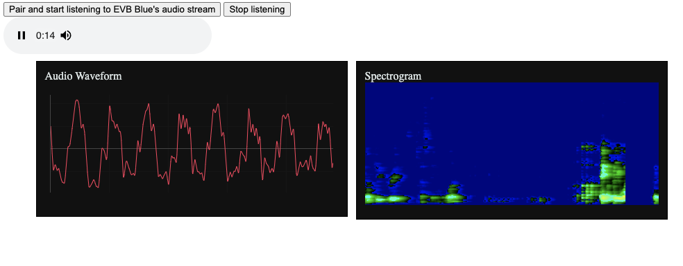

# neuralSPOT now supports Opus Audio Encoding
neuralSPOT now support Opus audio encoding. With this feature, the size of audio data can be reduced by roughly 75% while maintaining good audio fidelity. This is useful for storing and moving audio data between an EVB and external devices, where it can be played and visualized.

> ** NOTE**: AI models tend to work best with 'raw' (non-encoded) audio, so this feature is not really for AI. Instead, it is intended to ease the creation of applications that move or store audio.

To demonstrate how the Audio Codec works, we've added a new example, `audio_codec`, which uses the codec to sample audio and send it to a remote player, either via RPC-over-USB, or via BLE.

## Audio over BLE

This example implements a dead-simple audio-over-BLE protocol: it creates a "notify read" characteristic and starts dumping Opus frames into it. Frame size is hardcoded at 320 PCM samples, and the Opus frame size is 80 bytes.

This example pairs with a web [dashboard](https://github.com/AmbiqAI/web-ble-dashboards/blob/main/audio/index.html) which is configured to look for the service created by this example. Once paired, the web dashboard will play the audio and show corresponding waveforms and spectrograms. This dashboard relies on WebBLE and WebAudio, which are not supported by every browser - it has been tested on recent Chrome browser versions.



## Audio over RPC

When configured for RPC, this example acts as an RPC client, sending  Opus packets over USB to an RPC server using neuralSPOT's generic data interface. To receive, decode, and record this audio to a WAV file, you can use the [opus_receive.py](https://github.com/AmbiqAI/neuralSPOT/tree/main/tools) script.

```bash
python3 -m opus_receive -t /dev/tty.usbmodem1234561 -o myaudio.wav
```
