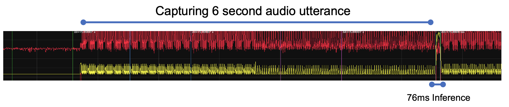
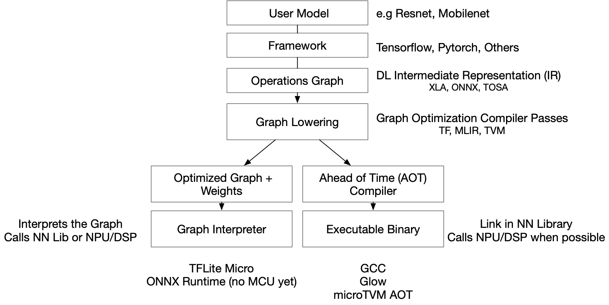
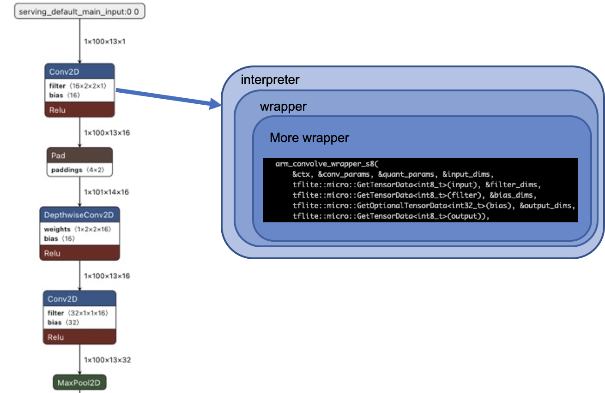

# Optimizing AI Execution Using neuralSPOT

Deploying AI features on endpoint devices is all about saving every last micro-joule while still meeting your latency requirements. This is a complex process which requires tuning many knobs, but neuralSPOT is here to help.

#### About This Article

This article focuses on optimizing the energy efficiency of inference using Tensorflow Lite for Microcontrollers (TLFM) as a runtime, but many of the techniques apply to any inference runtime.

## Optimizing Inference

AI feature developers face many requirements: the feature must fit within a memory footprint, meet latency and accuracy requirements, and use as little energy as possible. Complicating matters, these requirements often conflict with each other. For example, improving accuracy may require larger models, which increase the memory footprint and energy consumption. Finding a solution meeting all constraints is a complex, empirical process.

### Not Just Inference

It is tempting to focus on optimizing inference: it is compute, memory, and energy intensive, and a very visible 'optimization target'. In the context of total system optimization, however, inference is usually a small slice of overall power consumption. For example, a speech model may collect audio for many seconds before performing inference for a few 10s of milliseconds. Optimizing both phases is critical to meaningful power optimization.



### How TFLM Runs Inference

Tensorflow Lite for Microcontrollers is an interpreter-based runtime which executes AI models layer by layer. Based on flatbuffers, it does a decent job producing deterministic results (a given input produces the same output whether running on a PC or embedded system). Being an interpreter, however, means performance is not so deterministic; energy performance (how many joules are consumed by a inference) is particulary non-deterministic.




Being based on an interpreter makes optimizing TFLM model inference difficult. TFLM interposes many layers of wrappers on each operation's fundamental execution kernel, and because it is interpreted at runtime, there is little end-to-end optimization possible. In addition to this, TFLM development is focused on reducing latency and memory footprint (in fairness, these are the biggest problems for many endpoint devices, and the TFLM team is making steady progress), but not as focused on energy efficiency. The result is more performant code that uses more energy per inference.




The end result is that TFLM is difficult to deterministically optimize for energy use, and those optimizations tend to be brittle (seemingly inconsequential change lead to large energy efficiency impacts).

## Optimizing for Energy

Optimizing AI energy on an embedded device is a matter of tuning some obvious and not-so-obvious knobs. The obvious knobs include memory placement, clock speed, peripheral power, and data buffer management. The less obvious knobs are things like TFLM version, static library linking order, compiler settings, and even memory alignment.

It's important to note that there isn't a 'golden configuration' that will result in optimal energy performance. Every application and model is different. TFLM's non-deterministic energy performance compounds the problem - the only way to know if a particular set of optimization knobs settings works is to try them.

## Using neuralSPOT to Optimize

neuralSPOT offers a number of tools and libraries to help optimize AI features:

1. **Data Ingestion Libraries**: efficient capture data from Ambiq's peripherals and interfaces, and minimize buffer copies by using neuralSPOT's feature extraction libraries.
2. **Power Control Library**: neuralSPOT's power library makes controlling Apollo's power settings easy, allowing the developer to choose a pre-optimized application-specific default configuration, or fine-grained control over power modes, peripherals, memory configuration and more.
3. **Power Measurement Tools**: neuralSPOT has built-in tools to help developers mark regions of interest via GPIO pins. These pins can be connected to an energy monitor to help distinguish different phases of AI compute.
4. **Examples**: neuralSPOT includes numerous power-optimized and power-instrumented examples illustrating how to use the above libraries and tools. Ambiq's ModelZoo and [MLPerfTiny](https://github.com/AmbiqAI/MLPerfTiny) repos have even more optimized reference examples.

### The Data Ingestion Libraries

The Audio library takes advantage of Apollo4 Plus' highly efficient audio peripherals to capture audio for AI inference. It supports several interprocess communication mechanisms to make the captured data available to the AI feature - one of these is a 'ring buffer' model which ping-pongs captured data buffers to facilitate in-place processing by feature extraction code. The basic_tf_stub example includes ring buffer [initialization](https://github.com/AmbiqAI/neuralSPOT/blob/70438d631a160988412aa3ba0c27e15d589ac92c/examples/basic_tf_stub/src/main.cc#L272) and [usage](https://github.com/AmbiqAI/neuralSPOT/blob/70438d631a160988412aa3ba0c27e15d589ac92c/examples/basic_tf_stub/src/main.cc#L256) (and [here](https://github.com/AmbiqAI/neuralSPOT/blob/70438d631a160988412aa3ba0c27e15d589ac92c/examples/basic_tf_stub/src/main.cc#L395)) examples.

### Power Control Library

The neuralSPOT Power Control library is a part of the [ns-peripheral](https://github.com/AmbiqAI/neuralSPOT/tree/main/neuralspot/ns-peripherals) component, and is used by every neuralSPOT example, such as [here](https://github.com/AmbiqAI/neuralSPOT/blob/70438d631a160988412aa3ba0c27e15d589ac92c/examples/rpc_client_example/src/rpc_client.cc#L70). It is typically called once, during initialization. 

> **NOTE** This is useful during feature development and optimization, but most AI features are meant to be integrated into a larger application which usually dictates power configuration.

The library is can be used in two ways: the developer can choose one of the predefined optimized power settings (defined [here](https://github.com/AmbiqAI/neuralSPOT/blob/70438d631a160988412aa3ba0c27e15d589ac92c/neuralspot/ns-peripherals/src/ns_power.c#L51)), or can specify their own like so:

```c
const ns_power_config_t myConfig = {
    .eAIPowerMode = NS_MAXIMUM_PERF,
    .bNeedAudAdc = true,
    .bNeedSharedSRAM = false,
    .bNeedCrypto = false,
    .bNeedBluetooth = true,
    .bNeedUSB = false,
    .bNeedIOM = true,
    .bNeedAlternativeUART = true,
    .b128kTCM = false
};

main() {
  ...
  ns_power_config(&myConfig);
  ...
}
```

### Power Measurement Helpers

When optimizing, it is useful to 'mark' regions of interest in your energy monitor captures. One way to do this is using GPIO to indicate to the energy monitor what region the code is executing in. Energy monitors like Joulescope have two GPIO inputs for this purpose - neuralSPOT leverages both to help identify execution modes.

For example, to set the GPIO to indicate that the code is inferring, the code is:

```c
ns_set_power_monitor_state(NS_POWERMON_INFERING);
```

### Obscure Knobs

As mentioned above, there are several non-obvious knobs that have energy performance impact, including TFLM version, linking order, and compilation settings.

1. TFLM version: configured via neuralSPOT's makefile [here](https://github.com/AmbiqAI/neuralSPOT/blob/70438d631a160988412aa3ba0c27e15d589ac92c/make/neuralspot_config.mk#L22).
2. Linking Order: configured via neuralSPOT's makefile [here](https://github.com/AmbiqAI/neuralSPOT/blob/70438d631a160988412aa3ba0c27e15d589ac92c/make/neuralspot_toolchain.mk#L48).
3. Compilation Settings: configured via neuralSPOT's makefile [here](https://github.com/AmbiqAI/neuralSPOT/blob/70438d631a160988412aa3ba0c27e15d589ac92c/make/neuralspot_toolchain.mk#L41). Note that the GCC optimization setting is a tradeoff between code size, performance, and energy efficiency. -O3 will result in the fastest, but slightly larger, code.

## Parting Words

Optimizing is a difficult task, requiring experimentation and tradeoffs. Fortunately, toolkits such as neuralSPOT can make it just a bit easier. neuralSPOT is constantly evolving - if you would like to contribute a performance optimization tool or configuration, see our [developer's guide](https://github.com/AmbiqAI/neuralSPOT/blob/main/docs/developer_guide.md) for tips on how to best contribute to the project.