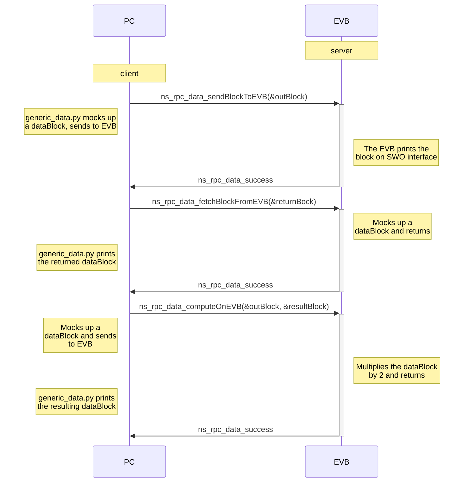

# RPC Generic Data Operations Server Example
RPC, or remote procedure calls, is a way for code running on two different CPUs (in this case, a PC and an EVB connected via USB) to call procedures between each other almost as if the procedure was running locally. It does so by communicating over a transport layer - in our case, we use serial-over-USB over second USB port on the EVB.

The `rpc-server.cc` example shows how to use `ns-rpc` when the EVB is the *server* and the PC is the *client*. In this configuration, the PC calls remote procedures and the EVB executes those procedures . This example is designed to work with `generic_data.py` (part of `ns-rpc`), a python script running on the PC that can be run as server or client.




We demonstrate the following EVB->PC procedure calls:

- `ns_rpc_data_sendBlockToEVB(&outBlock)`: Passes a generic dataBlock to the EVB server. `dataBlock_t` is defined as part of the GenericDataOperations RPC interface. The example server simply prints the this block.
- `ns_rpc_data_fetchBlockFromEVB(&inBlock)`: Requests a generic dataBlock from the EVB server. `dataBlock_t` is defined as part of the GenericDataOperations RPC interface. The example server mocks up a small dataBlock and returns it to the client, which prints it on the CLI.
- `ns_rpc_data_computeOnEVB(&computeBlock, &resultBlock)`: Passes a dataBlock to the EVB, and gets a different dataBlock in return. The two do not have to be the same shape or data type. This RPC is intended for remote computation such as calculating MFCC remotely, or testing the EVB's inference results versus the remote results. The example mocks a simple dataBlock and sends it to the EVB, which multiplies it by 2 and returns it, whereupon the PC prints the the result on the CLI.

It's a client/server system needing some careful staging, described below.

## Installation and Setup
You'll need to install some laptop-side software, including ERPC's python library.

> *NOTE* for Windows, see our [Windows eRPC application note](../../docs/Application-Note-neuralSPOT-and-Windows.md)

1. Clone our erpc fork (git@github.com:AmbiqAI/erpc.git)
2. Install erpc_python (instructions here: https://github.com/AmbiqAI/erpc/tree/develop/erpc_python)
3. Install Python Libraries needed for our example Python application - see [here](../../neuralspot/ns-rpc/README.md) for a how to run it for the first time.

## Running the RPC-server example
Running RPC requires a bit of staging. The PC-side server cant start until the USB TTY interface
shows up as a device, and that doesn't happen until we start servicing TinyUSB, and even then it doesn't happen immediately.

To address this, rpc-client loop swaiting for a button press, servicing USB. This gives the user a chance to start the server then
pressing the button to let the EVB it is ready to start RPCing.

1. Compile and flash the NeuralSPOT rpc-server example
2. Connect the second USB cable to your laptop - you'll now have 2 USB connections between the EVB and the laptop
3. Run the rpc-server EVB code (it should be running if you flashed, unless you have something like GDB interrupting execution)
4. Monitor the EVB SWO printout - you should see "Start the PC-side client, then press Button 0 to get started"
5. At this point, the second USB connection should come alive. It will mount as a USB TTY device. On a Mac, it'll look something like `/dev/tty.usbmodem1234561`, on a windows PC it'll be `COMx` or similar. If the device doesn't pop up, there is a problem. It won't show up until "Press Button" shows up, so make sure you got that far.
6. Start the laptop-side RPC client . 
```bash
$> cd neuralSPOT/neuralspot/ns-rpc/python/ns-rpc-genericdata
$> python -m generic_data -t /dev/tty.usbmodem1234561 -o myaudio.wav -m client
Client started - press enter send remote procedure calls to EVB
```
If all went well, you can press Button 0, which will start the server. At this point you can press 'enter' on the PC, which sends the 3 example RPC calls to the EVB.


