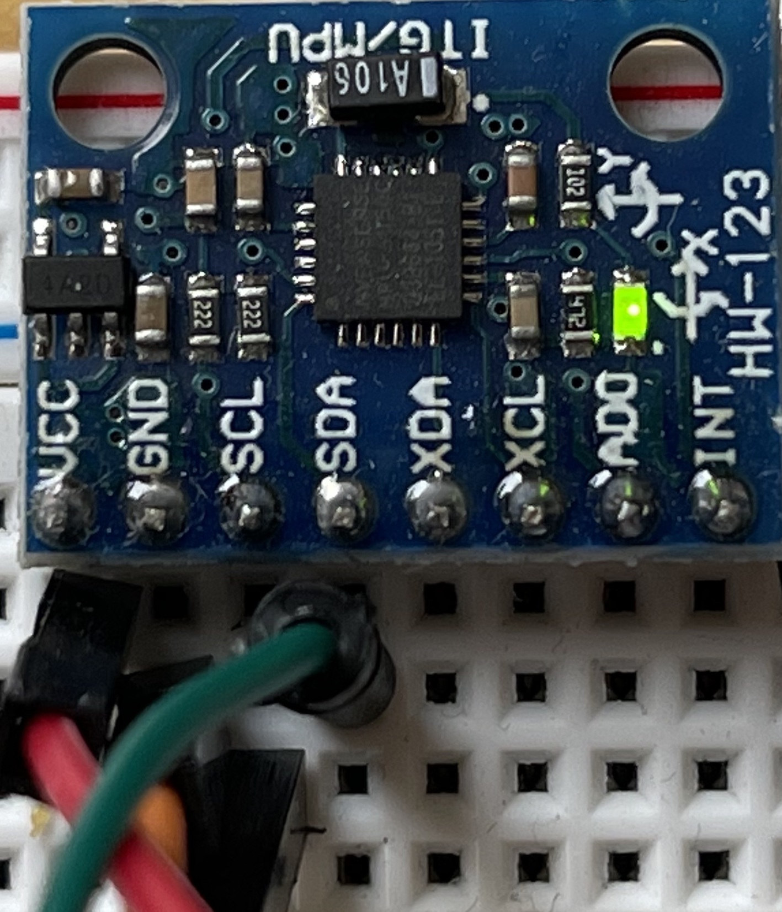
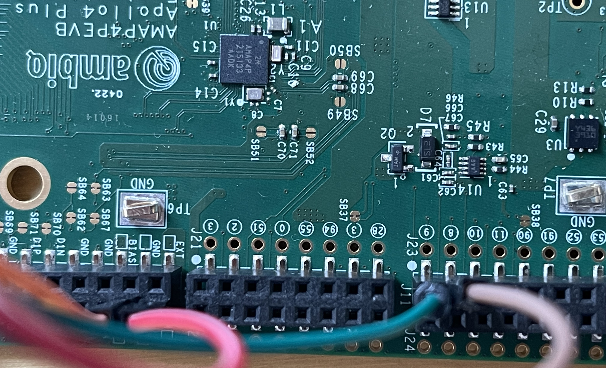

# neuralSPOT i2c Utilities
This library contains a basic i2c interface driver to initialize the i2c interface and read/write registers over it.
It also contains sample drivers for a selection of i2c devices.

# Hooking up the MPU6050
This sample MPU6050 driver is used by neuralSPOT's example/har and example/mpu_data_collection examples, which configure the i2c interface to use IOM1. Connecting an MPU6050 to IOM1 involves wiring the SDA and SCL i2c wires, and optionally the VDD and GND wires (the VDD/GND connection from the EVB is for convenience, other power sources can be used.)

1. IOM1 SCL is on Pin 8 of EVB header J23. Connect this to SCL on MPU6050.
2. IOM1 SDA is on Pin 9 of EVB header J23. Connect this to SDA on MPU6050.
3. 5V VDD is available on the 5V pin of EVB header J17
4. GND is available on the GND pin of EVB header J17

