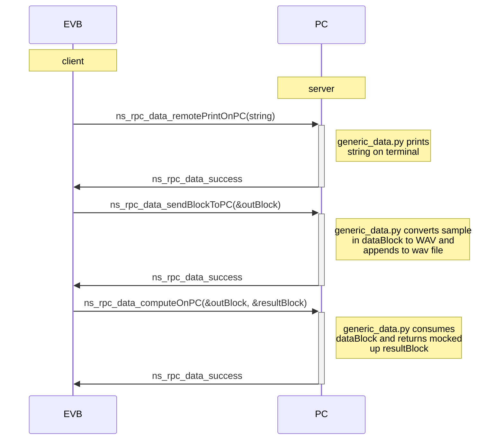

# NeuralSPOT RPC Library
This directory contains RPC interfaces, NeuralSPOT wrappers for using those interfaces, and Python examples for creating PC-side applications that interact with those interfaces.

RPC (Remote Procedure Call) interfaces are a way to 'call' functions that reside on another CPU (in NeuralSPOT's case, on another computer entirely). NeuralSPOT RPC is based on [a modified fork](https://github.com/AmbiqAI/erpc) of [EmbeddedRPC (eRPC)](https://github.com/EmbeddedRPC/erpc) which supports RPC-over-TinyUSB on our EVBs. How eRPC works, including the [specifics of IDL definition](https://github.com/EmbeddedRPC/erpc/wiki/IDL-Reference), is outside the scope of this document.

For example, this what the GenericDataOperations EVB-to-PC interaction looks like:



## NS-RPC Directory Structure
```bash
ns-rpc/
	interfaces/ # contains IDL definition files
	includes-api/ # API for each interface
	python/ # PC-side code implementing the interface and example client/servers using it
	src/ # Code implementing the interface and wrapping it for neuralspot
```
Examples for using ns-rpc:

- [Client Example](https://github.com/AmbiqAI/neuralSPOT/examples/rpc_client_example/README.md)
- [Server Example](https://github.com/AmbiqAI/neuralSPOT/examples/rpc_server_example/README.md)

Guidelines for creating new interfaces or modifying existing interfaces can be found in our [developer's guide](https://github.com/AmbiqAI/neuralSPOT/docs/developer_guide.md#neuralspot-developers-guide).

## Running generic_data.py for the first time
Our example RPC Python application, `generic_data.py` uses eRPC to communicate with the EVB. It can function in both client and server modes, and demonstrates how to capture both audio and MPU data.

This application requires several Python packages:
1. PySerial to communicate with USB TTY devices
2. numpy to facilitate working with arrays
3. SoundFile to convert PCM data to WAV files

The simplest way to install this packages is using `pip`:

```bash
$> pip install pyserial
$> pip install numpy
$> pip install soundfile
```

Managing python and package versions is beyond the scope of this article - if you are using your PC to develop AI models it is likely you have your preferred setup. Otherwise, the simplest way to manage all of this is using a pre-package Python development environment such as Anaconda. 

For bare-bones Windows Python configration, see our [Windows application note](../../docs/Application-Note-neuralSPOT-and-Windows.md).