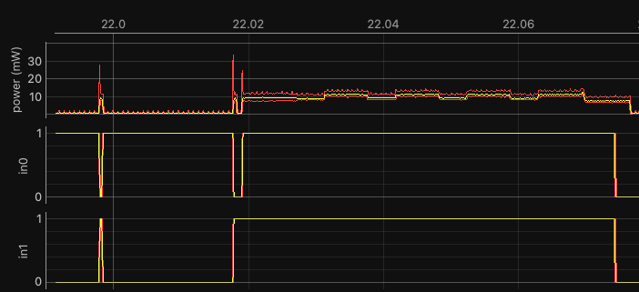

# neuralSPOT Utilities Library
The ns-utils library is a assorted collection of utilities to help with various aspects of development, debug, and optimization. It includes:

| Utility           | Description                                                  |
| ----------------- | ------------------------------------------------------------ |
| ns_energy_monitor | Tools to help mark 'regions of interest' for external energy monitors via GPIO |
| ns_perf_profile   | Tools to capture, analyze, and display cache and instruction performance counters |
| ns_pmu_utils      | Set of utilities for setting up, capturing, and parsing PMU event counters |
| ns_power_profile  | Prints out Ambiq configuration registers impacting power - useful for interacting with Ambiq FAEs |
| ns_timer          | Implements various clocks and timers                         |
| ns_malloc         | RTOS-friendly malloc() and free()                            |


## Energy Monitor

This simple library allows you to control two GPIO pins which can be monitored by some external energy monitor tools to mark 'regions of interest' (e.g. feature extraction vs. inference). For example, Joulescopes have two inputs which can be displayed along with the energy waveforms - in the diagram below, `in0` and `in1` distinguish between audio capture (in0 = 1 and in1=0), feature extraction (in0 = 1 and in1 = 0), inference (both 1) and idle (both 0).



Using this requires connecting the following pins to the energy monitor:

| Platform | Joulescope In 0 | Joulescope In 1 |
| -------- | --------------- | --------------- |
| Apollo4 Plus | 22 | 23 |
| Apollo4 Lite | 61 | 23 |
| Apollo3  | 22  | 23  |
| Apollo5 EB | GP74 | GP75 |
| Apollo5 EVB | 29 | 36 |

And the following code:

```c
    ns_init_power_monitor_state(); // Initialize the monitor
    ns_set_power_monitor_state(NS_IDLE); // Set a state (in this case, idle)
```

The pre-defined states are below (of course, these can be used however needed - they don't have to correspond to the state names):

```c
#define NS_IDLE 0
#define NS_DATA_COLLECTION 1
#define NS_FEATURE_EXTRACTION 2
#define NS_INFERING 3
```

## Performance Profile

The ns_perf_profile library includes helper functions for collecting, analyzing, and printing cache and instruction performance counters.

### Cache Monitor

Using the cache monitor requires that you enable it, capture values before and after the region of value, and print the results.

> *Note* The Cache monitor system slightly increases power consumption - we recommend it is only used during development, not in production.

```c
// Variables
ns_cache_config_t cc;
ns_cache_dump_t start;
ns_cache_dump_t end;

// Init and enable the DMON
cc.enable = true;
ns_cache_profiler_init(&cc);

// Capture the start values
ns_capture_cache_stats(&start);

// Code you're interested in watching
interesting_foo();

// Capture the end values
ns_capture_cache_stats(&end);

// Print out the difference between start and end
ns_print_cache_stats_delta(&start, &end);
```

### Instruction Performance Monitor

Likewise, the instruction performance counters (based on [Arm DWT](https://developer.arm.com/documentation/ddi0439/b/Data-Watchpoint-and-Trace-Unit/DWT-functional-description)) require that enable it, reset values before, read values after the region of value, and print the results.

```c
ns_init_perf_profiler(); // resets the counters, but doesn't enable them

ns_reset_perf_counters(); // if not sure of intervening code, reset counters again
ns_start_perf_profiler(); // enables all counters

// Code you're interested in profiling
interesting_foo();

ns_stop_perf_profiler(); // Stop the counters to make sure your not measuring yourself
ns_capture_perf_profiler(&pp); // Capture values
ns_print_perf_profile(&pp); // Print values and analysis
```

## Timer

The ns_timer helper functions allow the instantiation of 4 timers with specific functions:

| Timer              | Function                                                     |
| ------------------ | ------------------------------------------------------------ |
| NS_TIMER_COUNTER   | Enable timerticks, useful for timing code                    |
| NS_TIMER_INTERRUPT | Enables an periodic interrupt callback                       |
| NS_TIMER_USB       | Dedicated USB timer, should only be used by ns_usb           |
| NS_TIMER_TEMPCO    | Dedicated temperature compensation timer, should only be used by ns_power |

### Counter

The NS_TIMER_COUNTER is used to keep track of time thusly:

```c
ns_timer_config_t example_tickTimer = {
    .api = &ns_timer_V1_0_0,
    .timer = NS_TIMER_COUNTER,
    .enableInterrupt = false,
};

main() {
	ns_timer_init(&example_tickTimer);

  ns_lp_printf("Before: %d\n",ns_us_ticker_read(&example_tickTimer));
  // area of interest to be timed
	interesting_foo();
  ns_lp_printf("After: %d\n",ns_us_ticker_read(&example_tickTimer));
}
```

## Periodic Interrupt

The NS_TIMER_INTERRUPT is useful when a periodic interrupt is needed. When configured, it will invoke the defined callback every defined period.

```c
static void
example_periodic_callback(ns_timer_config_t *c) {
    // Invoked in ISR context every timertick (per below, 1ms)
    do_periodic_task(); // whatever you need
}

ns_timer_config_t exampleTimer  = {
    .api = &ns_timer_V1_0_0,
    .timer = NS_TIMER_INTERRUPT,
    .enableInterrupt = true,
    .periodInMicroseconds = 1000, // one 1ms
    .callback = example_periodic_callback
};

main() {
	ns_timer_init(&exampleTimer);
	...
}
```

## Malloc/Free

Dynamic memory is usually avoided in RTOS environments, and neuralSPOT manages to do so except for RPC (which isn't intended to be used in production). However, there are many cases in which malloc/free are needed (e.g. edgeimpulse integration). The ns_malloc helper function is an instantiation of FreeRTOS's heap_4 implementation, which provides a reasonable compromise between heap management and real-time behavior for infrequent malloc invocations.

`ns_malloc()` allocates from a statically defined heap. The heap must be allocated by each application at compile time. neuralSPOT components that use malloc such as ns-ble and ns-rpc have default heap sizes that can serve as starting points for what the size should be, but the needs of each application will vary.

Malloc and Free work as usual:

```c
// Some compilers need this to be word aligned
uint8_t ucHeap[NS_RPC_MALLOC_SIZE_IN_K*1024]  __attribute__ ((aligned (4)));

void *memPtr = ns_malloc(requested_size);

// do stuff with memPtr

ns_free(memPtr); // put allocated block back into free heap
```
