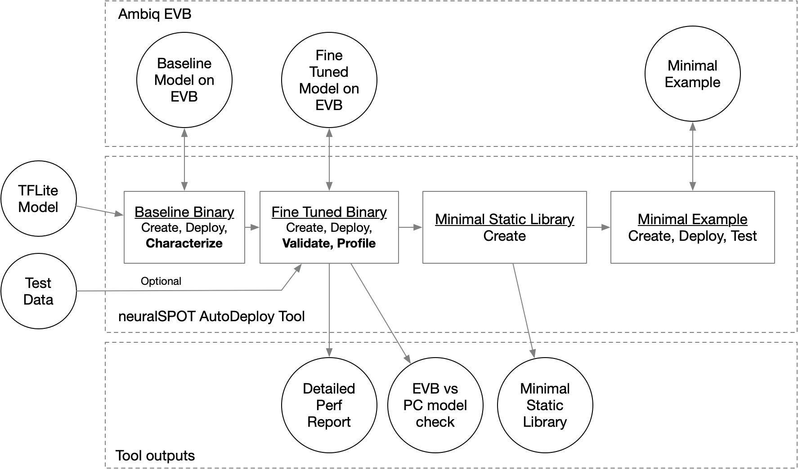

# NeuralSPOT Tools
This directory contains assorted scripts designed to work with neuralSPOT.

1. **generic_data.py**: example RPC script
2. **ns_autodeploy.py**: Convert TFlite to binary, fine tune, and characterize.
3. **ns_mac_estimator.py**: Analyzes a TFLite file and estimates macs per layer
4. **schema_py_generated.py**: Cloned from TLFM repo, used by tflite_profile.py


## AutoDeploy Theory of Operations
The ns_autodeploy script is a all-in-one tool for automatically deploy, testing, profiling, and package TFLite files on Ambiq EVBs.



Briefly, the script will:

1. Load the specified TFLite model file and compute a few things (input and output tensors, number of layers, etc.)
1. Convert the TFlite into a C file, wrap it in a baseline neuralSPOT application, and flash it to an EVB
1. Perform an initial characterization over USB using RPC and use the results to fine-tune the application's memory allocation, then flash the fine-tuned version.
1. Run invoke() both locally and on the EVB, feeding the same data to both, optionally profiling the performance of the first invoke() on the EVB
1. Compare the resulting output tensors and summarize the differences, and report the performance (and store it in a CSV)
1. Create a static library (with headers) containing the model, TFLM, and a minimal wrapper to ease integration into applications.

Example usage:
```bash
$> cd neuralSOT/tools
$> python -m ns_autodeploy --tflite-filename=../trained_models/model.tflite --random-data --create-binary --profile-enable --runs 100 --profile-warmup 3
```

This will produce output similar to:


### Caveats

This script is experimental, with known limitations (we're working on addressing these):
- Only one input and output tensor are supported

- Only 1 subgraph is supported
