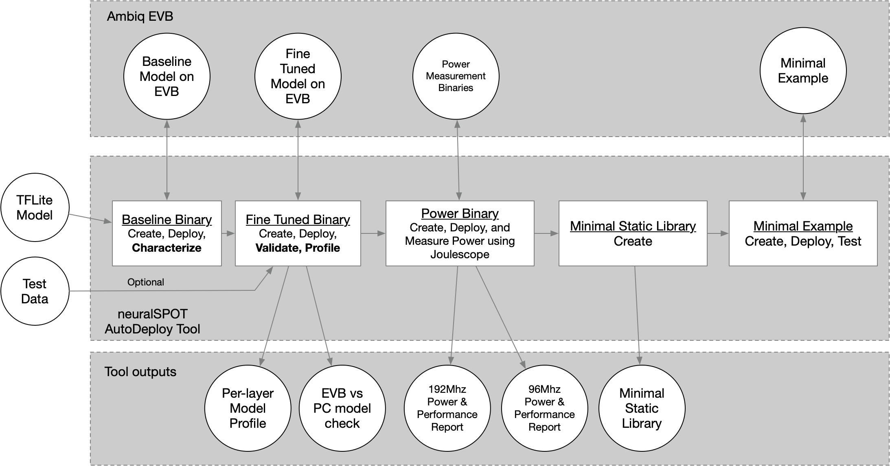

# NeuralSPOT Tools
This directory contains assorted scripts designed to work with neuralSPOT.

1. **generic_data.py**: example RPC script
2. **ns_autodeploy.py**: Convert TFlite to binary, fine tune, and characterize.
3. **ns_mac_estimator.py**: Analyzes a TFLite file and estimates macs per layer
4. **schema_py_generated.py**: Cloned from TLFM repo, used by ns_mac_estimator.py


## AutoDeploy Theory of Operations
The ns_autodeploy script is a all-in-one tool for automatically deploy, testing, profiling, and package TFLite files on Ambiq EVBs.



*NOTE*: For a detailed description of how AutoDeploy can be used to characterize a TFLite model on Apollo EVBs, see [the application note](../docs/From%20TF%20to%20EVB%20-%20testing,%20profiling,%20and%20deploying%20AI%20models.md).


Briefly, the script will:

1. Load the specified TFLite model file and compute a few things (input and output tensors, number of layers, etc.)
1. Convert the TFlite into a C file, wrap it in a baseline neuralSPOT application, and flash it to an EVB
1. Perform an initial characterization over USB using RPC and use the results to fine-tune the application's memory allocation, then flash the fine-tuned version.
1. Run invoke() both locally and on the EVB, feeding the same data to both, optionally profiling the performance of the first invoke() on the EVB
1. Compare the resulting output tensors and summarize the differences, and report the performance (and store it in a CSV)
1. If a joulescope is present and power profiling is enable, run 96Mhz and 192Mhz inferences to measure power, energy, and time per inference.
1. Create a static library (with headers) containing the model, TFLM, and a minimal wrapper to ease integration into applications.

Example usage:
```bash
$> cd neuralSOT/tools
$> python -m ns_autodeploy --tflite-filename=../trained_models/model.tflite --random-data --create-binary --profile-enable --runs 100 --profile-warmup 3
```

This will produce output similar to:


### Autodeploy Command Line Options

```python -m ns_autodeploy --help
optional arguments:
  --seed SEED           Random Seed (default: 42)
  --no-create-binary    Create a neuralSPOT Validation EVB image based on TFlite file (default: True)
  --no-create-profile   Profile the performance of the model on the EVB (default: True)
  --no-create-library   Create minimal static library based on TFlite file (default: True)
  --measure-power       Measure power consumption of the model on the EVB using Joulescope (default: False)
  --tflite-filename TFLITE_FILENAME
                        Name of tflite model to be analyzed (default: model.tflite)
  --tflm-filename TFLM_FILENAME
                        Name of TFLM C file for Characterization phase (default: mut_model_data.h)
  --max-arena-size MAX_ARENA_SIZE
                        Maximum KB to be allocated for TF arena (default: 120)
  --arena-size-scratch-buffer-padding ARENA_SIZE_SCRATCH_BUFFER_PADDING
                        (TFLM Workaround) Padding to be added to arena size to account for scratch buffer (in KB) (default: 0)
  --max-rpc-buf-size MAX_RPC_BUF_SIZE
                        Maximum bytes to be allocated for RPC RX and TX buffers (default: 4096)
  --resource-variable-count RESOURCE_VARIABLE_COUNT
                        Maximum ResourceVariables needed by model (typically used by RNNs) (default: 0)
  --max-profile-events MAX_PROFILE_EVENTS
                        Maximum number of events (layers) captured during model profiling (default: 40)
  --dataset DATASET     Name of dataset (default: dataset.pkl)
  --no-random-data      Use random data (default: True)
  --runs RUNS           Number of inferences to run for characterization (default: 100)
  --runs-power RUNS_POWER
                        Number of inferences to run for power measurement (default: 100)
  --cpu-mode CPU_MODE   CPU Speed (MHz) - can be 96 or 192 (default: 96)
  --model-name MODEL_NAME
                        Name of model to be used in generated library (default: model)
  --working-directory WORKING_DIRECTORY
                        Directory where generated library will be placed (default: ../projects/autodeploy)
  --profile-warmup PROFILE_WARMUP
                        How many inferences to profile (default: 1)
  --verbosity VERBOSITY
                        Verbosity level (0-4) (default: 1)
  --tty TTY             Serial device (default: /dev/tty.usbmodem1234561)
  --baud BAUD           Baud rate (default: 115200)

help:
  -h, --help            show this help message and exit
```

### Caveats
There is a known TFLM bug wherein the arena size estimator fails to account for temporary scratch buffers. If this occurs, the defaul ns_autodeploy parameters will cause a configuration failure, and the script will exit with the following error:
```bash
Model Configuration Failed
```
When this occurs, padding for scratch buffers must be manually added via the `--arena_size_scratch_buffer_padding` option. The value, in kilobytes, must be chosen via experimentation (in other words, pick a number and go up or down from there).
