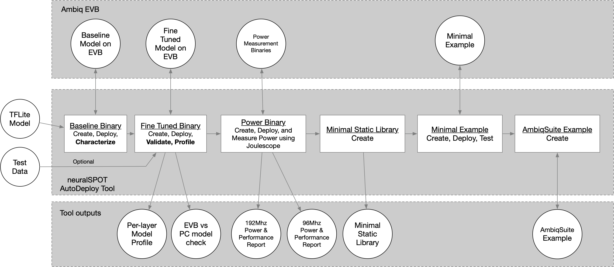

## NS_AutoDeploy Theory of Operations

The ns_autodeploy script is a all-in-one tool for automatically deploy, testing, profiling, and package TFLite files on Ambiq EVBs.

> **Note**: Intel Macs are no longer supported due to liteRT being unavailable for that platform.



*NOTE*: For a detailed description of how AutoDeploy can be used to characterize a TFLite model on Apollo EVBs, see [the application note](../docs/From%20TF%20to%20EVB%20-%20testing,%20profiling,%20and%20deploying%20AI%20models.md).


Briefly, the script will:

1. Load the specified TFLite model file and compute a few things (input and output tensors, number of layers, etc.). The TFLite file is statically analyzed to identify unoptimized paths and suggest alternatives.
1. Convert the TFlite into a C file, wrap it in a baseline neuralSPOT application, and flash it to an EVB
1. Perform an initial characterization over USB using RPC and use the results to fine-tune the application's memory allocation, then flash the fine-tuned version.
1. Run invoke() both locally and on the EVB, feeding the same data to both, optionally profiling the performance of the first invoke() on the EVB
1. Compare the resulting output tensors and summarize the differences, and report the performance (and store it in a CSV)
1. If a joulescope is present and power profiling is enabled, run inferences in both LP and HP modes to measure power, energy, and time per inference.
1. Create a static library (with headers) containing the model, TFLM, and a minimal wrapper to ease integration into applications.
1. Create a simple AmbiqSuite example suitable for copying into AmbiqSuites example directory.

Example usage:
```bash
$> ns_autodeploy --tflite-filename ../model_perf_tests/models/kws/kws_ref_model_aligned.tflite --joulescope
```

This will produce output similar to:

```bash
[NS] neuralSPOT root directory found at .../neuralSPOT
[NS] Destination Root Directory automatically set to: .../neuralSPOT/projects/autodeploy
[NS] Model Name automatically set to: kws_ref_model_aligned
[NS] Running 3 Stage Autodeploy for Platform: apollo510_evb
[NS] Max Arena Size for apollo510_evb: 2458 KB
[NS] Best 53KB model location for apollo510_evb: TCM
[NS] Using TensorFlow Version: ns_tflm_v1_0_0

[NS] *** Stage [1/3]: Create and fine-tune EVB model characterization image
[NS] Compiling and deploying Baseline image: arena size = 2458k, arena location = SRAM model_location = TCM, Resource Variables count = 0
[NS] Compiling and deploying Tuned image:    arena size = 27k, arena location = TCM model_location = TCM, Resource Variables count = 0

[NS] *** Stage [2/3]: Characterize model performance on EVB
[NS] Calling invoke on EVB 10 times.
100%|████████████████████████████████████████████████████████| 10/10 [00:00<00:00, 53.70it/s]

[NS] *** Stage [3/3]: Characterize inference energy consumption on EVB using Joulescope
[NS] Compiling, deploying, and measuring LP power, model location = TCM, arena location = TCM.
[NS] Compiling, deploying, and measuring HP power, model location = TCM, arena location = TCM.

Characterization Report for kws_ref_model_aligned:
[Profile] Per-Layer Statistics file:         kws_ref_model_aligned_stats.csv
[Profile] Model Size:                        53 KB
[Profile] Total Estimated MACs:              2656768
[Profile] Total Model Layers:                13
[Power]   HP Inference Time (ms):      7.856
[Power]   HP Inference Energy (uJ):    219.483
[Power]   HP Inference Avg Power (mW): 27.939
[Power]   LP Inference Time (ms):      20.495
[Power]   LP Inference Energy (uJ):    160.130
[Power]   LP Inference Avg Power (mW): 7.813
```

For this example `--joulescope` was enabled, which requires specific HW and configuration. For more information on how to measure power using Autodeploy, see see [the application note](../docs/From%20TF%20to%20EVB%20-%20testing,%20profiling,%20and%20deploying%20AI%20models.md).

Autodeploy is capable of showing more information via the `verbosity` command line option. For example, for a detailed per-layer performance analysis, use `--verbosity=1`, though this same information is always saved as a CSV and excel file.


### Automatic Behaviors
Autodeploy uses automation to simplify it's usability. It knows the target platform capabilities and the TFlite model's characteristics, and uses that to determine:
- What transport to use (UART or USB, depending on apollo EVB), and what TTY to connect to (depending on host operating system)
- Whether the model fits on the platform, and if so, where to best place it.

Autodeploy uses the specified `--platform` to automatically determine many of the command line parameters. Note that these parameters can be overridden using the related CLI parameter.

1. model_location: chosen based on computed model size
   1. If the model size exceeds MRAM size it will result in a compile error. For AP510 EVBs with PSRAM, you can set model_location manually to PSRAM (via `--arena-location PSRAM`).

1. arena_location: chosen based on arena size (max for first iteration, computed for rest)
1. max_arena_size: chosen based on platform's largest SRAM.
   1. If the arena exceeds SRAM size it will result in a compile error. For AP510 EVBs with PSRAM, you can then set it manually to 10000 (the amount of PSRAM allocated to arenas) and set arena_location manually to PSRAM (via `--arena-location PSRAM`)

1. ambiqsuite version: latest for platform
1. tensorflow version: latest compiled for platform

Knowing the platform also allows platform-specific error checking, such as
  1. Checks in memories (arena and model size) exceed a platform's capabilities
  1. Ensures that perf and example stages are not run unless the model fits in MRAM (larger models require USB, and perf/examples do not include USB)

Platform capabilities are specified in a separate yaml file (tools/ns_platform.yaml) for easy updating.

### Very Large Model Support
Autodeploy allows users to specify where the model will be stored (MRAM, TCM, SRAM, PSRAM) and where the tensor arena (e.g. activations) will be stored (TCM, SRAM, PSRAM) via the `model-location` and `arena-location` command line parameters. This allows profiling and comparison of different memory combinations.

For models that do not fit into on-board memories (aka Very Large Models aka VLMs), autodeploy supports locating those models in PSRAM and loading of the weights via USB. This capability is only supported by the profiling (i.e. create-profile) functionality since the performance binaries do not include USB enablement in order to minimize power.

To run a VLM, invoke ns_autodeploy like so:
```bash
ns_autodeploy --platform apollo510_evb --tflite-filename .../efficientnet-lite0-int8.tflite --runs 1 --model-location PSRAM --arena-location PSRAM
```
Note the arena size (when using PSRAM, it can be as high as 10MB, or 10000), and the number of runs being '1' (large models may take a long time to infer). The script will upload the model via USB, which may take some time, invoke it, and return the resulting tensors. Models as large as 20MB weights and 10MB arena are supported. For statistics capture, up to 1600 layers are supported.

The model used as an example above (efficientnet-lite0-int8) needs 1.6MBs for the arena, which happens to fit in SRAM. To place it there instead of PSRAM, use the following command:
```bash
ns_autodeploy --platform apollo510_evb --tflite-filename .../efficientnet-lite0-int8.tflite --runs 1 --model-location PSRAM --arena-location SRAM
```

### HeliaAOT Support (experimental)
Autodeploy has experimental support for Ambiq's ahead-of-time AI runtime compiler, HeliaAOT. When HeliaAOT is installed, the user can add it to the Validation and Performance phases via the `--create-aot-profile` command line parameter.

> **NOTE**: helia-aot support is *experimental*. AOT does not yet support the full breadth of TF operations and numerics, so some model conversions will fail. In these cases, ns_autodeploy will note the error and run the rest of the TFLM phases.

#### Connecting neuralSPOT to HeliaAOT
1. Install HeliaAOT by cloning and following the HeliaAOT installation instructions.
2. In neuralSPOT, add HeliaAOT to the environment (see below)
3. If all goes well, invoking ns_autodeploy will print `[NS] HeliaAOT module is available`

```bash
$> cd .../neuralSPOT
$> uv sync # if this hasn't been installed yet
$> source .venv/bin/activate # or Windows equivalent, if venv hasn't been activated yet
$> uv add ../helia-aot # Substitute your path to helia-aot
```

When `--create-aot-profile` is enabled, ns_autodeploy will:
1. Invoke helia-aot to generate the runtime for the specified tflite
2. Run the AOT model after the TFLM model and 1) compare the output tensors for the same inputs, 2) characterize performance using DWT or PMU counters
3. If `--joulescope` is enabled, run AOT versions of the model and measure power and latency using joulescope
4. if `--onboard-perf` is enabled, run AOT versions of the onboard perf firmware

### Autodeploy Command Line Options

```bash
$ ns_autodeploy --help
...
Evaluate TFLite model

optional arguments:
  --seed SEED                           Random Seed (default: 42)
  --platform PLATFORM                   Platform to deploy model on (e.g. apollo4p_evb, apollo510_evb...) (default: apollo510_evb)
  --toolchain TOOLCHAIN                 Compiler to use (supported: gcc, arm) (default: gcc)
  --no-create-binary                    Disable Create a neuralSPOT Validation EVB image based on TFlite file (default: True)
  --no-create-profile                   Disable Profile the performance of the model on the EVB (default: True)
  --create-library                      Create minimal static library based on TFlite file (default: False)
  --create-ambiqsuite-example           Create AmbiqSuite example based on TFlite file (default: False)
  --create-aot-profile                  Add a HeliaAOT profiling and benchmarking pass (default: False)
  --helia-aot-config HELIA_AOT_CONFIG   HeliaAOT configuration YAML file (or 'auto') (default: auto)
  --joulescope                          Measure power consumption of the model on the EVB using Joulescope (default: False)
  --onboard-perf                        Capture and print performance measurements on EVB (default: False)
  --full-pmu-capture                    Capture full PMU data during performance measurements on EVB (default: False)
  --tflite-filename TFLITE_FILENAME     Name of tflite model to be analyzed (default: undefined)
  --configfile CONFIGFILE               Optional configuration file for parameters (default: )
  --pmu-config-file PMU_CONFIG_FILE     M55 PMU configuration override file for peformance profiling (default: default)
  --model-location MODEL_LOCATION       Where the model is stored on the EVB (Auto, TCM, SRAM, MRAM, or PSRAM) (default: auto)
  --tflm-location TFLM_LOCATION         Where the TFLM library is stored on the EVB (auto, MRAM, or ITCM (M55 only)) (default: auto)
  --arena-location ARENA_LOCATION       Where the arena is stored on the EVB (auto, TCM, SRAM, or PSRAM) (default: auto)
  --max-arena-size MAX_ARENA_SIZE       Maximum KB to be allocated for TF arena, 0 for auto (default: 0)
  --arena-size-scratch-buffer-padding ARENA_SIZE_SCRATCH_BUFFER_PADDING
                                        (TFLM Workaround) Padding to be added to arena size to account for scratch buffer (in KB) (default: 0)
  --resource-variable-count RESOURCE_VARIABLE_COUNT
                                        Maximum ResourceVariables needed by model (typically used by RNNs) (default: 0)
  --no-random-data                      Disable Use random input tensor data (default: True)
  --dataset DATASET                     Name of dataset if --random_data is not set (default: dataset.pkl)
  --runs RUNS                           Number of inferences to run for characterization (default: 10)
  --runs-power RUNS_POWER               Number of inferences to run for power measurement (default: 200)
  --cpu-mode CPU_MODE                   CPU Mode for joulescope and onboard_perf modes - can be auto, LP (low power), or HP (high performance) (default: auto)
  --model-name MODEL_NAME               Name of model to be used in generated library, 'auto' to use TFLite filename base (default: auto)
  --destination-rootdir DESTINATION_ROOTDIR
                                        Directory where generated library will be placed, 'auto' to place in neuralSPOT/projects/autodeploy (default: auto)
  --neuralspot-rootdir NEURALSPOT_ROOTDIR
                                        Path to root neuralSPOT directory, 'auto' to autodetect if run within neuralSPOT (default: auto)
  --resultlog-file RESULTLOG_FILE       Path and Filename to store running log results. If none, result is not recorded. (default: none)
  --profile-results-path PROFILE_RESULTS_PATH
                                        Path to store per-model profile results in addition to the file in the working directory. If none, the additional result file is not generated. (default: none)
  --ambiqsuite-version AMBIQSUITE_VERSION
                                        AmbiqSuite version used to generate minimal example, 'auto' for latest (default: auto)
  --tensorflow-version TENSORFLOW_VERSION
                                        Tensorflow version used to generate minimal example, 'auto' for latest (default: auto)
  --profile-warmup PROFILE_WARMUP       How many inferences to profile (default: 1)
  --verbosity VERBOSITY                 Verbosity level (0-4) (default: 1)
  --nocompile-mode                      Prevents compile and flash, meant for GDB debug (default: False)
  --run-log-id RUN_LOG_ID               Run ID for the run log. If none, no ID is included in report. (default: none)
  --transport TRANSPORT                 RPC transport, 'auto' for autodetect. Can set to USB or UART. (default: auto)
  --tty TTY                             Serial device, 'auto' for autodetect (default: auto)
  --baud BAUD                           Baud rate, 'auto' for autodetect (default: auto)
```

### Caveats
There is a known TFLM bug wherein the arena size estimator fails to account for temporary scratch buffers. If this occurs, the defaul ns_autodeploy parameters will cause a configuration failure, and the script will exit with the following error:
```bash
Model Configuration Failed
```
When this occurs, padding for scratch buffers must be manually added via the `--arena_size_scratch_buffer_padding` option. The value, in kilobytes, must be chosen via experimentation (in other words, pick a number and go up or down from there).
