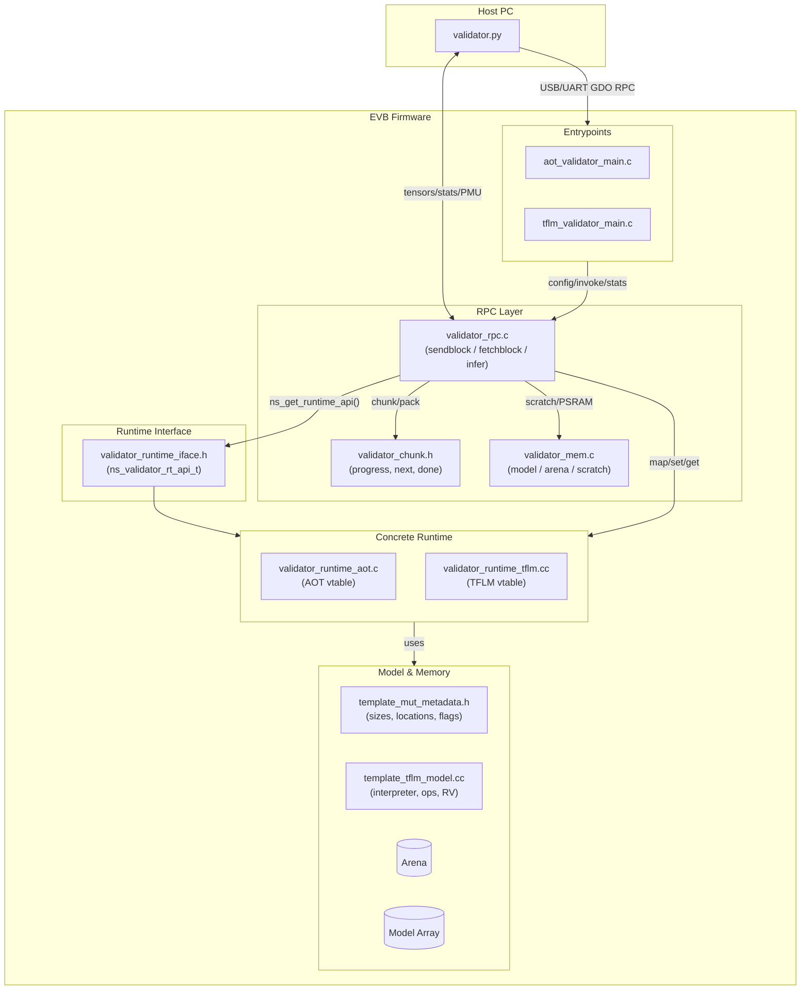

Awesome—here’s an updated `README.md` with a Mermaid diagram that maps the end-to-end flow.

---

# Validator Templates — neuralSPOT Autodeploy

This directory contains the **autogenerated templates and runtime glue** for the validator framework. The validator exposes a **uniform RPC surface** to load/configure models (TFLM or AOT), run inferences, and stream profiling/PMU stats between host and EVB.

> Most files are generated by `tools/autodeploy/validator.py`. Treat them as codegen outputs—prefer changing templates or well-defined extension points.

---

## Layout

```
tools/autodeploy/templates/validator
├─ aot/
│  ├─ aot_validator_main.c            # AOT entrypoint + RPC wiring + stats hook
│  └─ validator_runtime_aot.c         # AOT runtime: ns_validator_rt_api_t impl
├─ tflm/
│  ├─ tflm_validator_main.c           # TFLM entrypoint + RPC wiring + stats hook
│  └─ validator_runtime_tflm.cc       # TFLM runtime: ns_validator_rt_api_t impl
├─ template_aot_validator.mk          # AOT build glue (sources/includes)
├─ template_tflm_validator.mk         # TFLM build glue (sources/includes)
├─ template_mut_metadata.h            # Build-time metadata → runtime macros
├─ template_tflm_model.cc             # TFLM interpreter setup & op resolver
├─ template_tflm_validator.h          # RPC config/stats structs (host<->EVB)
├─ validator_chunk.[ch]               # Tiny chunking helpers for big payloads
├─ validator_mem.[ch]                 # Model/arena pointers, PSRAM hooks, scratch
├─ validator_rpc.c                    # RPC handlers + chunking + packing
└─ validator_runtime_iface.h          # ns_validator_rt_api_t (runtime vtable)
```

---

## What Each Piece Does

### Entrypoints

* **`aot/aot_validator_main.c`**
  Initializes core/power/PSRAM, sets up RPC (USB/UART), implements `vrpc_on_after_invoke()` to export **per-layer µs timings** (and PMU availability on AP5).

* **`tflm/tflm_validator_main.c`**
  Same shape for TFLM. When `NS_MLPROFILE` is enabled, wires TFLM profiler buffers (CSV header + event rows) to the outgoing stats.

### Runtimes (implement the same interface)

* **`validator_runtime_aot.c`**
  C runtime. Installs a model callback to stamp **op boundaries**; records per-layer timings and (AP5) PMU accumulator snapshots. Also implements a uniform PMU API (header, per-layer counters, and one-time full characterization) exposed via the runtime vtable.

* **`validator_runtime_tflm.cc`**
  C++ runtime. Owns `ns_model_state_t`, builds the interpreter from `ns_mem_model_ptr()` / arena, supports **resource variables**, and flushes profiler CSV via `tflm_stats_hook()`. Implements the same PMU API using TFLM’s debug/profiler sidecar (CSV header, per-layer counters, and `ns_characterize_model()`).


### Core Glue

* **`validator_rpc.c`**
  Runtime-agnostic RPC layer:

  * `decodeIncomingSendblock()` → config, input chunks, optional model chunks (PSRAM).
  * `decodeIncomingFetchblock()` → stats (and AP5 per-layer PMU streaming).
  * `infer()` → copy (or map) input → `invoke()` → package outputs (full or chunked).
  * Uses `ns_validator_rt_api_t` vtable from `ns_get_runtime_api()`.

* **`validator_mem.[ch]`**
  Strong overrides for scratch buffers; model/arena placement (SRAM/TCM/PSRAM). Provides `vrpc_model_write()` for **model streaming to PSRAM**.

* **`validator_chunk.[ch]`**
  Zero-overhead helpers for **multi-packet** send/receive.

* **`template_mut_metadata.h`**
  Single source of truth for sizes/locations and feature flags (e.g., `NS_AD_AOT`, arena size, transport type, PMU events).

* **`template_[aot|tflm]_validator.mk`**
  Build outputs: `<app>.axf` and `<app>.bin`. Adds generator outputs and (for AOT) CMSIS-NN sources.

---

## Lifecycle (High Level)

1. **(Optional) Model stream → PSRAM**
   Host sends chunks → `vrpc_model_write()`.

2. **Configure**
   Host sends `mut_cfg` + tensor sizes → bind runtime via `ns_get_runtime_api()` → `init()`.

3. **Infer**
   Host sends input (single block or chunked map) → `invoke()` → outputs returned (full/part).

4. **Fetch stats / PMU**
   Host calls fetch; EVB returns profiler CSV (and AP5 per-layer PMU snapshots).

---

## Mermaid Diagram (Host ⇄ EVB ⇄ Runtime)



---

## Profiling & PMU

* **Timing:**

  * AOT: per-layer µs via `aot_profiler_cb()`; exported in `vrpc_on_after_invoke()`.
  * TFLM: `LogCsv()` dumps profiler rows; CSV header propagated to host.

* **AP5 PMU:**

  * Minimal PMU config in entrypoints; events come from metadata macros.
  * **Full PMU mode**: after “FullStats” fits in one packet, EVB streams per-layer PMU counters on subsequent fetches.

---

## Key Macros & Defaults

* **Runtime select:** `NS_AD_AOT` (0 = TFLM, 1 = AOT)
* **Memory placement:** `TFLM_MODEL_LOCATION`, `TFLM_ARENA_LOCATION` ∈ {`NS_AD_TCM`, `NS_AD_SRAM`, `NS_AD_PSRAM`, `NS_AD_MRAM`}
* **RPC transport:** `NS_VALIDATOR_RPC_TRANSPORT` ∈ {`NS_AD_RPC_TRANSPORT_USB`, `…_UART`}
* **Buffers:**

  * RX/TX: `TFLM_VALIDATOR_{RX,TX}_BUFSIZE`
  * Output hold (defaults): `NS_OUTPUT_TENSOR_BUFFER_SIZE` (platform-dependent)
  * TX safety margin: `VRPC_TX_MARGIN` (default 1000 bytes)

---

## Maintaining / Extending

* **Prefer template edits** (headers/Makefiles) to direct changes in generated files.
* **Keep RPC and host tool in lockstep**: if you change chunk semantics, headers, or opcodes in `validator_rpc.c`, mirror the change in `validator.py`.
* **Add metrics**: implement or extend `vrpc_on_after_invoke()` and/or the runtime’s `get_stats_hook()`.
* **New transports**: add a branch to entrypoints and plumb buffer limits into `vrpc_tx_payload_max()`.
* **AOT op coverage**: add CMSIS-NN sources in `template_aot_validator.mk` if kernels expand.

---

## Quick Reference

* **Public vtable:** `ns_validator_rt_api_t` (`init`, `set_input`, `map_input_writable`, `invoke`, `get_output`, `map_output_readonly`, `get_stats_hook`, `arena_used_bytes`)
* **RPC trio:** `decodeIncomingSendblock`, `decodeIncomingFetchblock`, `infer`
* **Memory hooks:** `ns_mem_{init_defaults,set_psram_base,model_ptr,arena_ptr,arena_size}`
* **Chunk helpers:** `ns_chunk_{begin,next,advance,done}`
